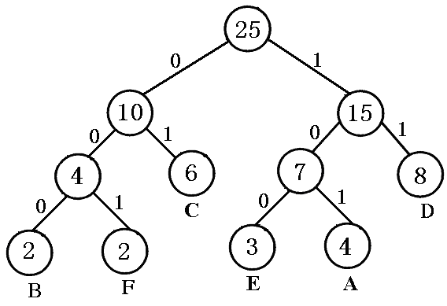

# 数据结构

[DATA STRUCTURE](https://github.com/xiufengcheng/DATASTRUCTURE)

## 第一章 概论

### 数据的逻辑结构

#### 数据元素

数据元素是数据的基本单位

#### 数据结构的3个内容

1. **逻辑结构：** 数据元素之间的逻辑关系
2. **存储结构：** 数据元素及其关系在计算机存储器内的表示
3. **数据运算：** 对数据施加的操作

#### 逻辑结构分类

1. **集合：** 最简单的数据结构，数据之间只有相似性。
2. **线性结构：**"一对一"的关系。
3. **树形结构：**"一对多"的关系。
4. **图形结构：**"多对多"的关系。

### 数据的存储结构

#### 顺序存储结构

借助元素在存储器中的**对应位置**表示数据元素之间的逻辑关系。

- 可实现对各数据元素的随机访问
- 不利于修改

#### 链式存储结构

借助指示元素存储位置的**指针**表示元素之间的逻辑关系。

- 利于修改
- 不能随机访问

#### 索引存储结构

在原有的存储结构的基础上，附加建立一个索引表，索引表中的每一项都由**关键字和地址**组成

索引表反映了按某一个关键字递增或递减排列的逻辑次序

采取索引存储的主要作用是为了提高数据的**检索**速度

#### 散列存储结构

通过构造散列函数来确定数据存储地址或查找地址

### 算法和算法分析

#### 算法的特性

1. **有穷性：** 没有死循环
2. **确定性：** 无歧义
3. **可行性：** 操作可实现
4. **输入：** >=0
5. **输出：** >=1

#### 算法的效率评价

$T(n)=n+n^2=O(n^2)$

## 第二章 List(线性表)

### 线性表的基本概念

#### 线性表的定义

线性表是具有相同数据类型的n(n≥0)个数据元素的有限序列

#### 线性表的基本操作

初始化、求长度、按地址搜索、按值搜索、插入、删除、显示

### 线性表的顺序存储

#### 顺序表的存储特点

- 逻辑结构和物理结构是一致的
- 任意数据元素都可以随机存取

#### 顺序表插入 ⚠️

1. 检查顺序表是否塞满,防溢出
2. 插入位置应在`a[0] + l`之内
3. 移动必须从最后一个节点开始

### 线性表的链式存储

#### 头节点和head

头节点不属于数据元素

动态申请一个结点空间，链表第一个结点的地址放到了指针变量head中

`head = (LinkList *) malloc (sizeof(LinkList)) ;`

#### 循环链表

最后一个结点的指针域为head

## 第三章 Stack(栈)

它的插入、 删除等操作只能在表的一端进行。固定操作的一端叫**栈顶(top)**，而另一端称为**栈底(bottom)**。

### 顺序栈

表头`a[0]`的一端作为栈底，指针 `top=length-1`

#### 上溢与下溢

##### 上溢(overflow)

栈满的情况下还入栈。对顺序栈进行插入元素之前，需要判断是否“栈满”，否则上溢

##### 下溢(underflow)

栈空的情况下还出栈。对顺序栈进行删除元素之前，需要判断是否“栈空”，否则下溢

#### 多栈共享空间

即两个栈栈底位置为两端，两个栈顶在中间不断变化，由两边往中间延伸。

### 链栈

链栈的**栈顶指针**就是单链表的**头指针**

唯一的约束条件是头指针的操作在头部执行

链栈一般不需要判定栈满，只需要判定栈是否为空。

栈空判定条件是: `S = NULL`

#### 进栈操作

```c++
bool Push_L(LinkStack &S, ElemType e) {
    LinkStack p;
    if((p=(LNode *)malloc(sizeof(LNode)))==NULL)
        return false;  				// 存储分配失败
    p->data=e;  
    p->next=S;                      // 插入新的栈顶元素
    S=p;                            // 修改栈顶指针
    return true;
    }// Push_L
```

#### 出栈操作

```c++
bool Pop_L( LinkStack &S, ElemType &e) {
    LinkStack p;
    if(S) {                    // 栈非空
        p=S;
        S=S->next;             // 修改栈顶指针
	e=p->data;                 // 元素e返回其值
	free(p);                   // 释放结点空间
	return true; 
    }
   else return false;          // 栈空，出栈失败
 }// Pop_L
```

#### 中缀表达式 > 后缀表达式

1. 读入操作数，直接送入输出符号栈
2. 读入运算符
    - 后进运算符优先级高于先进的，则继续进栈
    - 后进运算符优先级不高于先进的，则将运算符号栈内高于或等于后进运算符级
别的运算符依次弹出后进栈
3. 读入括号
	- 遇到开括号 (，进运算符号栈
	- 遇到闭括号 )， 则把最靠近的开括号 ( 以及其后进栈的运算符依次弹出到符号栈
4. 遇到结束符 “#”，则把运算符号栈内的所有运算符号依次弹出并压入输出符号栈
5. 若输入为+、 –单目运算符，改为 0 与运算对象在前，运算符在后  

## 第四章 Queue(队列)

### 定义

- 允许插入的一端叫**队尾(rear)**
- 允许删除的一端叫**队首(front)**

### 顺序队列

#### 假溢出

队首前还有空间的入队溢出

##### 判断条件

`rear >= maxsize && front > 0`

##### 解决方法

1. 修改出队算法：使每次出队列后都把队列中剩余的元素向front方向移动一个位置。O(n)
2. 修改进队算法：当假溢出时，把队列中的所有元素向front方向移动一个位置。O(n)
3. 顺序循环队列

#### 顺序循环队列

##### 顺序循环队列定义

- 把顺序队列改造成一个头尾相连的循环表
- 入队时，把元素插到rear指示位置，然后rear++
- 出队时，把front指示位置元素删除，然后front++

##### 判空和判满

1.队尾留一个单元

判满：`(rear+1) mod maxsize = front`

判空：`rear == front`

2.标志位

判满：`(rear==front) && (tag==1)`

判空：`(rear==front) && (tag==0)`

3.计数器

判满条件：`(rear==front) && count>0`

判空条件：`count == 0`

##### 元素个数

`N = (rear - front + maxsize) % maxsize`

##### 入队操作

```c++
int inQueue (seqQueue *Q, dataType x){

    if((Q->rear+1) % MAXSIZE == Q->front){
	return 0;
    }
    
    else if((Q->rear+1) % MAXSIZE != Q->front){
	Q->rear = (Q->rear+1) % MAXSIZE;
	Q->data[Q->rear] = x;
	reutn 1;
    }
}
```

### 链队

##### 出链队操作

```c++
bool deQueue_L(kinkQueue &Q, ElemType &e){
    QueuePtr p;
    if(Q.front==NULL)
        return false;
    
    p=Q.front;				// 暂存队首指针以便回收队首结点
    e=p->data;				// e返回队首元素的值
    Q.front = p->next;		
    if(Q.front==NULL)		// 若删除后队列为空，则使队尾指针为空
        Q.rear = NULL;
    
    free(p);
    return true;
}
```

##### 入队操作

```c++
bool enQueue_L(likQueue &Q, ElemType e){
    queuePtr s;
    if((s=(LNode *)malloc(sizeof(LNode)))==NUll)
        return false;                   // 存储分配失败
    
    s->data = e;
    s->next = NULL;
    
    if(Q.rear==NULL){
        Q.front = Q.rear = s;           // 若链队为空,则新结点既是队首结点又是队尾结点
    }else if(Q.rear!=NULL){
        Q.rear = Q.rear->next = s;      // 若链队非空，则新结点被链接到队尾并修改队尾指针
    } 
}
```

## 第五章 String(串)

### 串

#### 定义

##### 子串

串中任意个连续的字符组成的子序列称为该串的子串

一个串也可以看成是自身的子串

##### 子串个数公式

`n(n+1)/2+1`

##### 真子串个数公式

`n(n+1)/2`

#### 串的比较

从左开始，第一个差异字符的大小关系

##### ASCII码

由**8bit**组成一个字符，共可形成2^8^=256个字符（仅英语）

##### Unicode码

由**16bit**组成一个字符，共可表示2^16^=65536个字符（全世界的字符）

#### 串和线性表的不同点

- 串的数据元素是字符，即每个数据元素都是**一个**字符
- 线性表的主要操作对象是某个**数据元素**
- 串的操作主要操作对象是**整体或某一部分子串**

### 顺序串

#### 静态存储分配的顺序串

用**定长**字符数组存储串值

由于串值空间的大小已经确定，所以对串的插入、连接等不利

```c++
typedef struct{
    char str[MaxStrSize];   //顺序串的最大容量
    int length;             //顺序串的当前长度
}SSqString;                 //静态顺序串类型
```

#### 动态存储分配的顺序串

串值空间的大小是在**程序执行时动态分配**而得

在串处理的应用程序中也常被选用

**Ps：**动态分配的顺序串完全可用动态存储分配的顺序表SqList来表示

```c++
typedef struct {
    char  *str;  // 先存放非空串的首地址，不分配内存
    int length;  // 存放串的当前长度
}DSqString;      //待到程序执行时，再根据插入、删除等操作动态增补空间
```

#### 串比较

```c++
int StrCompare_Sq(DSqString S,DSqString T){

    int i=0;
    while(i<S.length&&i<T.length){           // 串S和串T对应字符进行比较
        if(S.str[i]>T.str[i]) return 1;
        else if(S.str[i]<T.str[i]) return -1;
        i++;
    }
    
    if(i<S.length) return 1;
    else if(i<T.length) return -1;

    return 0;
}// StrCompare_Sq
```

#### 取子串

在顺序串S中从第POS个位置开始，取长度为len的子串sub。

```c++
bool SubString_Sq(DSqString S,DSqString &Sub,int pos,int len){
    int i;
	if(pos<0||pos>S.length-1||len<0||len>S.length-pos)  
	return false;                          // 取子串的位置或子串的长度不合理

    if(Sub.str)   free(Sub.str);               // 释放Sub原有空间

    if(len!=0) { Sub.str=NULL; Sub.length=0; } // 置Sub为空子串
    else {
        if(!(Sub.str=(char *)malloc(len*sizeof(char)))) 
            return false;
        for(i=0;i<len;i++)                     // 将串S中的len个字符复制到Sub中
        Sub.str[i]=S.str[pos+i];
        Sub.length=len;                        // 子串Sub的串长为len
    }
    return true;
}// SubString_Sq
```

### 链式串

#### 定义

一个节点可以存放多个字符

**单链结构：**结点大小为1的链式串

**块链结构：**结点大小大于1的链式串

在块链结构中最后一个结点通常填不满，则用#号把串值填满。

#### 块链数据结构

```c++
typedef struct Chunk{      //可由用户定义的节点大小
      char str[Number];    //一个节点存放Number个字符
      struct Chunk  *next;
}Chunk;                    //定义结点类型

typedef struct{
   Chunk  *head, *tail;    //串的头尾指针
   int length;             //串的当前长度
}
```

### KMP算法

[KMP](https://mp.weixin.qq.com/s/kCjRuY6ygYJWWX5HPVLa5A)

#### Next的求法

前缀后缀的最大公共元素长度

## 第六章 Array(数组)

### 数组

#### 注意事项

**元素推广性**：元素本身可以具有某种结构，而不限定是单个的数据元素。

**元素同一性**：元素具有相同的数据类型。

**关系确定性**：每个元素均受n（n≥1）个线性关系的约束，元素个数和元素之间的关系一般不发生变动。

#### 数组与线性表的区别

- 数组是线性表的推广
- 线性表：元素的线性排列（有序），其元素为**原子类型**
- 数组：将线性表中数据元素的**类型扩充**为线性表
- 数组的操作只能是**存取和修改**，
而线性表除此之外还可以做**插入与删除**等操作

### 矩阵的压缩存储

压缩存储一般是针对矩阵中包含了**大量值相同的元素**或**零元素**的矩阵

#### 基本思想是

- **同值压1**：为多个值相同的元素只分配一个存储空间；
- **零值不分**：对零元素不分配存储空间。

#### 矩阵的分类

- **特殊矩阵**：矩阵中有许多值相同的元素且它们的分布有一定规律。
- **稀疏矩阵**：矩阵中有许多零元素并且零元素的分布没有规律。

### 广义表

#### 定义

- 广义表是线性表的推广
- 线性表中的元素都是原子的**单元素**
- 广义表中的元素也可以是一个**子广义表**
- 广义表的定义是递归的，广义表是线性表的**递归**数据结构

#### 广义表的深度

所有子表中表的最大深度加1

若为原子，其深度为0

#### 广义表的长度

在广义表中，**同一层次**的每个节点是通过link域链接起来的

所以可把它看做是由link域链接起来的单链表

求广义表的长度就是求单链表的长度

#### 广义表的存储

由于广义表中既可存储原子也可以存储子表

通常情况下广义表结构采用**链表**实现

#### 头尾表

```c++
typedef struct GLNode{
    int tag;        //标志域, 原子节点为0
    union{
        char atom;  //原子结点的值域
        struct{
            struct GLNode * hp, *tp;
        }ptr;       // hp指向本子表结点, tp指向广义表结点
    };
}*Glist;
```

#### 左孩子右兄弟

```c++
typedef struct GLNode{
    int tag;                //标志域
    union{
        int atom;
        struct GLNode *hp;  //hp指向本表子节点
    };
    struct GLNode * tp;     //tp指向广义表下一级
}*Glist;
```

#### 混合表示

## 第七章 Tree(树)

- 递归方法是树结构算法的基本特点

### 定义

##### 结点

数据元素的别名

##### 根结点

树有且只有的特殊结点称，根结点没有前驱结点

##### 集合

**线性表**对应的是**序列**，**树对应的是集合**

##### 结点的度

树中结点所拥有的**子树**的个数

##### 树的度

树中各结点度的最大值

##### 二叉树

度为2的树

##### 层数

根结点的层数为1，其余结点的层数等于它的父结点的层数+1

##### 深度

所有结点的最大层次

##### 叶子结点

终端结点

度为0的结点

##### 分枝结点

非终端结点

度不为0的结点

##### 子结点

一个结点的子树的根结点

##### 父结点

一个子结点的上层结点（唯一）

##### 兄弟

具有相同父结点的结点

##### 子孙

一个结点的**所有子树**中的结点

##### 祖先

从根结点到该结点所经分支上的所有结点

##### 堂兄弟

父节点在同一层但不同

##### 有序树

树中结点的各子树从左到右是有次序的

##### 森林

m(m≥0)棵不相交的树的集合称为森林

任何一棵树，删去根结点就变成了森林

### 树的基本性质

- 树中的结点数等于所有结点的度数加1
- 度为 $d$ 的树中第 $i$ 层上至多$d^{~i-1}$个结点
- 具有 $n$ 个结点的 $d$ 叉树的最小深度为 $log_d[n(d-1)+1]$

### 树的存储结构

#### 双亲表示法

用指针表示出每个结点的**双亲**在存储空间的位置信息

容易寻找双亲，不容易找孩子，也不能反映各**兄弟间的关系**

##### 双亲数组法

用**一维结构体数组**依次存储树中的各结点

数组元素中包括结点本身的信息和**双亲在数组中的下标**

```c++
struct {
    TElemType data;
    int parent;
}PTreeNode;

PTreeNode PTree[MAX_TREE_SIZE];
```

##### 双亲链表法

用**一组任意的存储单元**存储树中各结点

结点中包括结点本身的信息和指向该结点的**双亲的指针**

```c++
struct PTNode{
    TElemType data;
    struct PTreeNode* parent;
}PTNode,PTNode*;  
```

#### 孩子表示法

又称为**多重链表表示法**

用指针表示出每个结点的**孩子**在存储空间的位置信息

容易寻找孩子结点，不容易找双亲结点

##### 孩子数组法

用**一维结构体数组**依次存储树中的各结点

数组元素中包括结点本身的信息以及结点的**孩子在数组中的下标**

```c++
struct {
    TElemType data;
    int child[MAX_SON_SIZE];
}CTreeNode;

CTreeNode CTree[MAX_TREE_SIZE];
```

##### 孩子链表法

用**一组任意的存储单元**存储树中各结点

结点中包括结点本身的信息和指向该结点的**所有孩子的指针**

```c++
struct CTNode {
    TElemType data;
    struct CTNode *child[MAX_SON_SIZE];
}CTNode,*CTree;
```

#### 双亲儿子表示法

##### 数组法

```c++
struct {
	TElemType data;
	int parent;
	int child[MAX_SON_SIZE];
}PCTreeNode;

PCTreeNode PCTree[MAX_TREE_SIZE];
```

##### 链表法

```c++
struct PCTNode{
	TElemType data;
	struct PCTNode *parent;
	struct PCTNode *child[MAX_SON_SIZE];
}PCTNode,*PCTree;
```

### 树的基本操作

#### 树的创建

在树的生成算法中，需要设置两个栈

一个用来存储**指向根结点**的指针，以便孩子结点向双亲结点链接之用

一个用来存储待**链接的孩子结点**的序号，以便能正确地链接到双亲结点的指针域

若这两个栈分别用stack和d表示，stack和d栈的深度不会大于整个树的深度

```c++
# define MS 10   // 栈空间的大小
void CreateTree(CTree &T,char *S){
	CTree stack[MS],p;
	int i=0,d[MS],top=-1;
	T=NULL;
	
	while(S[i]){ 
		switch(S[i]){  
			case ' ': break;
			case '(': top++;stack[top]=p; d[top]=0;break;
			case ')': top--;break;  
			case ',': d[top]++;break;

		default: if(!(p=(CTree)malloc(sizeof(CTNode)))) exit(1);
		
		p->data=S[i];

		for(int i=0; i<MAX_SON_SIZE; i++)
			p->child[i]=NULL; 
		
		if(!T) T=p;
		else stack[top]->child[d[top]]=p;
		}
	i++;
	}
}// CreateTree
```

#### 树的遍历

##### 遍历的类型

- 先序遍历 DLR ：**先根再左后右**
- 中序遍历 LDR ：**先左再根后右**
- 后序遍历 LRD ：**先左再右后根**
- 层序遍历：从根结点开始，从上至下逐层遍历

##### 遍历的实现

```c++
void PreOrderTree(CTree T,void Visit(TElemType)){
    if(T) {
        Visit(T->data);                         
        for(int i=0;i<MAX_SON_SIZE;i++)
            PreOrderTree(T->child[i],Visit);  
    }	
}// PreOrderTree
```

```c++
void PostOrderTree(CTree T,void Visit(TElemType)) {
    if(T) {     
        for(int i=0;i<MAX_SON_SIZE;i++)
            PostOrderTree(T->child[i],Visit);  
        Visit(T->data);   
     }
}// PostOrderTree
```

```c++
void LevelOrderTree(CTree T,void Visit(TElemType)) {    
    SqQueue Q;                           
    CTree p;
    InitQueue_Sq(Q,MAX_TREE_SIZE,10);
    
    if(T) EnQueue_Sq(Q,T);
    
    while(!QueueEmpty_Sq(Q)) {   
        DeQueue_Sq(Q,p);                
        Visit(p->data);                   
        for(int i=0;i<MAX_SON_SIZE;i++) 
            if(p->child[i]) EnQueue_Sq(Q,p->child[i]);
     }  
}// LevelOrderTree

```

### 二叉树

#### 满二叉树

一棵深度为 $k$ 且有 $2^{k-1}$ 个结点的二叉树

#### 完全二叉树

前n-1层是满的，
但允许在**最底层右边缺少**连续若干个结点

#### 序列确定树

由二叉树的**前序序列**和**中序序列**，或**后序序列**和**中序序列**均能唯一地确定一棵二叉树

1. 后序序列的最后为根节点
2. 中序序列根节点的左边为左子孙，右边同理
3. 在后序序列中找到左右子孙的根节点，递归

#### 二叉链表

```c++
typedef struct BiTNode { 
    TElemType data; 
    struct BiTNode *lchild;                    
    struct BiTNode *rchild;                    
}BiTNode,*BiTree;

```

#### 中序遍历

```c++
void InOrderBiTree(BiTree BT,void Visit(TElemType)) {   
    if(BT) {   
        InOrderBiTree(BT->lchild,Visit);       
        Visit(BT->data);                      
        InOrderBiTree(BT->rchild,Visit);      
    }
}// InOrderBiTree
```

#### 线索二叉树

在n个结点的二叉链表中，必定存在n+1个空指针域

如果能利用这n+1个空链域，使它们分别指向某种遍历次序的前驱或后续

这种指向结点前驱和后继的指针叫做**线索**

##### 结点实现

```c++
typedef struct BiThrNode {
    TElemType data;               
    BiThrNode *lchild,*rchild;    
    unsigned short LTag:1;        
    unsigned short RTag:1;        
}BiThrNode, *BiThrTree;

```

若 LTag=0, lchild域指向左孩子；若 LTag=1, lchild域指向其前驱


#### 树和二叉树的转换

##### 树 => 二叉树

1. **连兄**：在兄弟结点间添加虚线
2. **去子**：任一结点仅除保留它与最左孩子的连线
3. **实顺虚逆**：实线向左转45°，虚线向右转45°

##### 二叉树 => 树

1. **连子**：连接右孩子的右孩子及其递归
2. **去右**：删去所有右链
3. **规整**

##### 森林 => 二叉树

1. 先将森林中的每棵树转化成二叉树
2. 将后一棵树当作前一棵树的根节点的**右子树**粘接

### 霍夫曼树

#### 编码类型

##### 等长编码

所有编码长度相同

##### 变长编码

用最短的编码来表示出现频率最高的字符

##### 无前缀编码

若使用不等长编码，则要求所有字符编码与所有前缀不同

也就是任一叶子结点都不可能是其他叶子结点的父节点

##### 霍夫曼编码

将字符集中的每一个字符当作叶子节点编码的二叉树

将字符出现的频率作为权重构造**霍夫曼树**

将左右分支分别用 0 和 1 编码得到**霍夫曼编码**

###### WPL

树中所有叶子结点的**带权路径长度**之和



WPL = 2 * (6+8) + 3 * (2+2+3+4)

#### 霍夫曼树的结点结构

```c++
typedef struct {
    int flag;				//上树标记
    int weight;  			//结点的权值
    int parent, lch, rch;    
}HTNode,*huffTree;
```

#### 霍夫曼编码的数据元素结构

```cpp
struct Code {
    int bit[MaxBit];	//叶结点的哈夫曼编码
    int start;			//编码的起始下标
    int weight;			//字符的权值
};
```

#### 霍夫曼树的创建

1. 找出目前最新的两个节点
2. 合并节点形成新根，为新根赋权
3. 递归

```c++
void creatHaffman(int weight[], int n, HTNode haffTree[]) {
//建立叶结点个数为n权值为weight的哈夫曼树haffTree
    
    int j, m1, m2, p1, p2;
    
    for (int i = 0; i<2 * n - 1; i++){
    //哈夫曼树haffTree初始化。n个叶结点的哈夫曼树共有2n-1个结点
        
        if (i<n)	//叶结点
            haffTree[i].weight = weight[i];
        else		//父节点
            haffTree[i].weight = 0;
        
        haffTree[i].parent = 0;
        haffTree[i].flag = 0;
        haffTree[i].lch = -1;
        haffTree[i].rch = -1;
    }
    
    for (int i = 0; i < n-1; i++) {
    //构造哈夫曼树haffTree的n-1个非叶结点
        
        m1 = m2 = MaxValue;	//Maxvalue=10e8;(正无穷)
        p1 = p2 = 0;		//保存最小的两个值对应的下标
 
        for (j = 0; j < n+i; j++) {
        //找出最小的二个值
            
            if (haffTree[j].weight < m1 && haffTree[j].flag == 0) {
                
                m2 = m1;
                m1 = haffTree[j].weight;
                p2 = p1;
                p1 = j;
            }
            else if(haffTree[j].weight < m2 && haffTree[j].flag == 0) {
                
                m2 = haffTree[j].weight;
                p2 = j;
            }
        }
        
        //将找出的两棵权值最小的子树合并为一棵子树
        haffTree[p1].parent = n + i;
        haffTree[p2].parent = n + i;
        haffTree[n + i].lch = p1;
        haffTree[n + i].rch = p2;
        haffTree[p1].flag = 1;
        haffTree[p2].flag = 1;
        haffTree[n + i].weight = haffTree[p1].weight + haffTree[p2].weight;
    }
}
```

#### 哈夫曼编码的创建

```c++
void HaffmanCode(HTNode haffTree[], int n, Code haffCode[]) {
//由n个结点的哈夫曼树haffTree构造哈夫曼编码haffCode
    
    Code *cd = new Code;
    int child, parent;
        
    for (int i = 0; i<n; i++) {
    //求n个叶结点的哈夫曼编码

        cd->start = 0;						//修改从0开始计数
        cd->weight = haffTree[i].weight;	//取得编码对应权值的字符
        child = i;
        parent = haffTree[child].parent;
        
        
        while (parent != 0) {
        //由叶结点向上直到根结点
            
            if (haffTree[parent].lch == child)
                cd->bit[cd->start] = 0;//左孩子结点编码0
            else (haffTree[parent].rch == child)
                cd->bit[cd->start] = 1;//右孩子结点编码1
                                             
            cd->start++;	//编码自增
            child = parent;
            parent = haffTree[child].parent;
        }
        
        //保存叶结点的编码和不等长编码的起始位
        for (int j = cd->start - 1; j >= 0; j--)
            
        	//重新修改编码，从根节点开始计数
        	haffCode[i].bit[cd->start - j - 1] = cd->bit[j];
 
        haffCode[i].start = cd->start;
        haffCode[i].weight = cd->weight;//保存编码对应的权值
    }
}
```

## 第八章 Graph(图)

### 图的定义

##### 回路或环

第一个顶点和最后一个顶点相同的路径

##### 网络

带权值的图

##### 稀疏图

顶点很多而边很少的图

##### 稠密图

顶点多边也多的图

##### 完全图

对于给定的一组顶点，顶点间都存在边

##### 连通图

任意两顶点之间都是连通的

##### 简单路径

V 到 W 之间所有顶点都不同（没有形成回路）

##### 连通分量

极大连通子图

1. 极大顶点数：再加任何1个顶点都不再连通

2. 极大边数：包含子图中所有顶点的所有边

##### 强连通

有向图两顶点之间存在双向路径

##### 生成树

极小连通子图。包含图的所有n个结点，但只含图的n-1条边。在生成树中添加一条边之后，必定会形成回路或环

### 图的储存

#### 邻接矩阵

邻接矩阵 G[N][N]——N 个顶点从 0 到 N-1 编号

##### 出(入)度

从改点发出的边数

无向图的度：对应行或列非零元素个数

有向图的出度：对应行非零元素个数

有向图的入度：对应列非零元素个数

#### 优点

直观、简单、好理解

方便检查任意一对顶点间是否存在边

方便找任一顶点的所有邻接点

方便计算任一顶点的度

#### 缺点

浪费空间——存稀疏图

浪费时间——统计稀疏图的边

#### 邻接表

邻接表：G[N] 为指针数组，对应矩阵每行一个链表，只存非 0 元素

##### 特点

方便找任一顶点的所有邻接顶点

节省稀疏图的空间

需要 N 个头指针 + 2E 个结点（每个结点至少 2 个域）

对于是否方便计算任一顶点的度

有向图：只能计算出度

不方便检查任意一对顶点间是否存在边

### 图的遍历

#### DFS

```c++
void DFS ( Vertex V ){
    visited[ V ] = true;
    for ( V 的每个邻接点 W )
        if( !visited[ W ])
            DFS( W );
}
```

#### BFS

```c++
void BFS( Vertex V ){
    queue<Vertex> q;
    visited[V] = true;
    q.push(V);
    
	while(!q.empty()){
        V = q.front(); 
		q.pop();
	
	for( V 的每个邻接点 W ) {
		if( !visited[ W ]) {
			visited[W] = true;
			q.push(W);
            }
        }
    }
}
```

### 最短路径

#### 定义

##### 最短路径（ShorttestPath）

在网络（带权图）中，两个不同顶点之间的所有路径中，**边的权值**之和最小的那一条路径

##### 最短路径问题

从某固定源点出发，求其到**所有其他顶点**的最短路径

##### 多源最短路径问题

求**任意两顶点**间的最短路径

####  无权图的单源最短路

BFS

```c++
void Unweighted(Vertex s){
    queue<Vertex> q;
    q.push(s);	//压入源点
    while(!q.empty()){
        
        v = q.pop();
        for( V 的每个邻接点 W){
            
            dist[W] = dist[v] + 1; 	// 当前距离上一距离 + 1
            path[W] = v;  			// s 到 w 的必经顶点就是前一个顶点 v
            q.push(W);
        }
    }
}
```

T = O ( V+E )

#### 有权图的单源最短路

##### Dijkstra

1. 令 S = 源点 + 已经确定了最短路径的顶点 vi

2. 对任一未收录的顶点 v，定义 `dist[v]` 为仅经过 **S 中的顶点**到 v 的最短路径长度

3. 如果 v 的加入减小了 S 中 `dist[w]` 的值，则：

	- v 和 w之间有边
	- v 到 w 的间接路径未被 S 收入
	- v 只能影响邻接点的 dist

```c++
dist[V] = 10e8;
path[V] = -1;
collected[V] = false;

void Dijkstra( Vertex s ){
    while(1){
        V = 未收录顶点中dist最小值;
        if( 这样的V不存在 ) break;
        
        collected[V] = true;
        
        for( V 的每个邻接点 W )
            if( collected[W] == false )
                if(dist[V] + E[V,W] < dist[W]){
             		dist[W] = dist[V] + E[V,W];
                    path[W] = V;
         }
    }
}
```

###### 时间复杂度

T = T(扫描未收录顶点中 `dist` 最小值) + T(更新 `dist[W]`)

1. 直接扫描所有未收录顶点

	- T = O(V^2^ + E) 

	- 稠密图效果更好

2. 将 dist 存在最小堆中 

	- T = O(V * logV + E * logV)

	- 稀疏图效果更好

#### 多源源最短路

##### 比较

1. 直接将单源最短路算法调用|V|遍

    - T = O(|V|^3^ + |E||V|)

    - 稀疏图效果好

2. Floyd 算法

    - T = O(|V|^3^)
    -  稠密图效果好

##### Floyd

逐步缩减每条最短路径

1. D^k^[i][j] = 路径 { i -> { l <= k } -> j }
2. D^-1^ 全为0的邻接矩阵
3. D^k-1^ => D^k^
    - D^k^[i][j] = D^k-1^[i][k] + D^k-1^[k][j]

```c++
void Floyd(){
    for( i = 0; i < N; i++ )
        for( j = 0; j < N; j++ ){
            D[i][j] = G[i][j];
            path[i][j] = -1;
        }
    
    for( k = 0; k < N; k++ )
        for( i = 0; i< N; i++)
            for( j = 0; j < N; j++ )
            	if( D[i][k] + D[k][j] < D[i][j] ) {
            		D[i][j] = D[i][k] + D[k][j];
                    path[i][j] = k;
                }
}
```

### 最小生成树 MST

#### 定义

- 树

    - 无回路

    - |V|个顶点则有|V|-1条边

- 生成树

	- 包含|V|-1条边

	- 任加一条边都会形成回路

- 边的权重最小

#### Prim

让一棵小树慢慢长大，**归并顶点**

T = O(|V|^2^ )

稠密图合算

```c++
void Prim(){
    MST = {s}; 			// parent[s] = -1
    while(1){
        V = 未收录顶点中dist最小者;
        if ( 这样的V不存在 ) break;
        
        dist[V] = 0;	// 将V收录进MST
        
        for ( V 的每个邻接点 W )
            if ( dist[W]!= 0)	// W没收录
                if ( E<V,W> < dist[w] ){
                    dist[W] = E<V,W>;
                    parent[W] = V;
                }
    }
    if ( MST 中收的顶点不到|V|个)
        Error ( "图不连通" );
}
```

#### Kruskal

将森林合并成树，**归并边**

T = O(|E|log|E|) 

稀疏图合算

```c++
void Kruskal ( Graph G ){
    MST = { };
    while ( MST 中不到|V|-1条边 && E中还有边 ) {
        从 E 中取一条权重最小的边 E<V,W>;    	/* 最小堆 */
        将 E<V,W> 从 E 中删除;
        if ( E<V,W> 不在 MST 中构成回路 )     /* 并查集 */
            将 E<V,W> 加入MST;
        else
            彻底无视 E<V,W>;
    }
    
    if ( MST 中不到|V|-1条边 )
        Error("图不连通");
}

```

### 拓扑排序

#### 定义

##### 拓扑排序

在用邻接表表示图时，对有n个顶点和e条弧的有向图而言时间复杂度为O(n+e)

一个有向图能被拓扑排序的充要条件就是它是一个**有向无环图**

拓扑序列唯一**不能唯一确定有向图**

##### AOV (Activity On Vertex)

用顶点表示活动，**边表示优先关系**的**有向无环图**

##### 拓扑有序序列

把AOV网络中各顶点按照它们相互之间的优先关系排列一个线性序列

若 i 是 j 前驱，则 i 一定在 j 之前；对于没有优先关系的点，顺序任意。

##### 拓扑排序方法

1. 在有向图中选一个**没有前驱**的顶点且输出

2. 从图中删除该顶点和所有它的出度

3. 重复上述两步

#### 算法

##### 回路检测

采用**DFS**或**拓扑排序**算法可以判断出一个有向图中是否有环(回路)

**BFS**过程中如果访问到一个已经访问过的节点，可能是多个节点指向这个节点，**不一定**是存在环。

##### 拓扑排序算法描述

1. 把邻接表中**入度为0**的顶点依次进**栈**
2. 若栈不空，则
    - 栈顶元素 j 出栈并输出
    - 在邻接表中查找 j 的直接后继 k，把 k 的入度减1
    - k 的入度为0则进栈
3. 若栈空时输出的顶点个数不是n，则有向图有环

#### 关键路径问题

##### AOE(Activity On Edge)

在工程上常用来表示工程进度计划

顶点表示事件，**边表示活动**，**权表示活动持续时间**的**有向无环图**，


##### 最早发生时间

从源点到结点的最短的路径，意味着事件最早能够发生的时间

##### 最迟发生时间

后序节点中最早开工的，事件必须发生的时间。

**机动时间**

最迟发生时间 - 最迟发生时间

**关键活动**

机动时间为0的活动（边）

##### 关键路径

从源点到汇点的最长的一条路径，或者全部由关键活动构成的路径

关键活动一定位于关键路径上

## 第九章 排序

| 排序方法 | 平均时间复杂度 | 最坏时间复杂度 | 空间复杂度 | 稳定性 |      |
| :------: | :------------: | :------------: | :--------: | :----: | ---- |
|   冒泡   |   逆序列对数   |    O(N^2^)     |    O(1)    |   Y    |      |
|   插入   |   逆序列对数   |    O(N^2^)     |    O(1)    |   Y    |      |
|   希尔   |                |                |            |        |      |
|    堆    |                |                |            |        |      |
|   快排   |                |                |            |        |      |
|   归并   |                |                |            |        |      |
|   基数   |                |                |            |        |      |
|          |                |                |            |        |      |
|          |                |                |            |        |      |

### 冒泡排序

利于链表

```c++
void Bubble_sort(long A[],int N){
	for(int i=0; i<N-1; i++) {  	// N-1次冒泡
		bool flag = false;  	// 验证是否交互过 
		for(int j=0; j<N-i-1; j++){
			if(A[j+1] < A[j]){
				flag = true; 
				swap(A[j],A[j+1]);
			}
		} 
		// 已经有序 
		if(flag == false) break; 
	} 
} 
```

### 插入排序

```c++
void Insertion_sort(long A[],int N){
	for(int i=1; i<N; i++) {  	
		long tmp = A[i];		// 摸一张新牌
        
		for(int j=i; tmp<A[j-1] && j>0; j--)
			A[j] = A[j-1];		// 移出空位
		A[j] = tmp;
	}
}
```

### 希尔排序

```c++
// 原始希尔排序 
void shell_sort(long A[],int N){
	for(int D=N/2; D>0; D/=2){
		for(int p=D; p<N; p++){
			long tmp = A[p];
			
			for(int k=p; k>=D && tmp<A[k-D]; k-=D) // j>=D 在前，因为也许 A[j-D]已经越界 
				A[k] = A[k-D];
			A[k] = tmp;
		}
	}
} 
```

