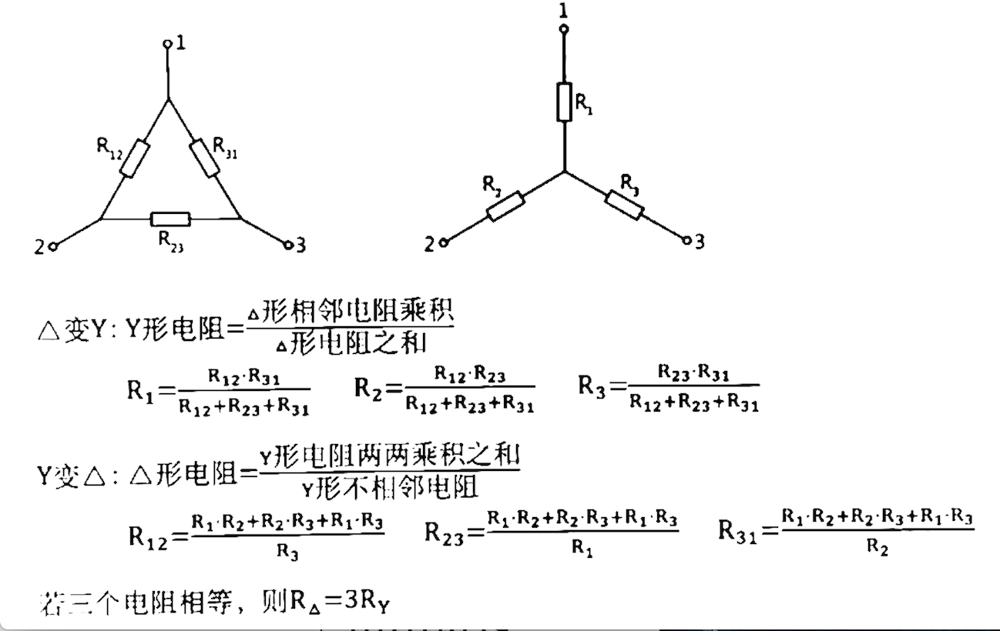

# 电路

## 第一章 直流电流

### 基尔霍夫定律

#### 支路

无分支的一段电路，不包括导线

一个支路中电流相同

#### 结点

三条及以上支路的连接点，一根导线加两个支路只有一个节点

#### 网孔

内部不另含支路的回路

#### KCL

流入和流出任一节点的所有电流的代数和为零

#### KVL

对任一回路，沿着指定的回路绕行方向，各元件两端的电压代数和为零

（`+ -> -` 为正）高压`->`低压

### 单口网络及等效

#### 单口网络（二端网络）

只有一个端口（一对端钮）与外部电路连接的电路。

#### 等效交换

电源：`- -> +` 与电阻相反

1. **电流源并联：** $i_s=\sum_{k=1}^iu_{sk}$
2. **电压源串联：**  $u_s=\sum_{k=1}^nu_{sk}$
3. **电压源与电流源串联：**省略电压源
4. **电压源与电流源并联：**省略电流源
5. **电流源与电阻并联 <-> 电压源与电阻串联**
6. **𝝙-Y等效变换**

$$
R_1=\frac{R_{12} \cdot R_{31}}{R_{12}+R_{23}+R_{31}}
$$

### 支路电流法

以**支路电流**为求解变量的分析方法

#### 求解过程

1. 找出n个**结点**，b条**支路**
2. 标出支路电流方向和参考方向
3. 根据KCL列出**节点-1**个独立的节点电流方程
4. 选定独立回路并指定每个回路的**绕行方向**，再根据KVL列出**支路-结点 +1**个回路电压方程
5. 解出各支路电流

### 结点电压法

适用于**节点少支路多**的电路

任选一**节点**作为参考，将其他节点到参考节点的**电压降**作为该节点的电压。
以**节点电压**为未知量，将各支路电流用节点电压表示，利用**KCL**列出独立电流方程求解。

#### 求解过程

1. 给待求项相关结点标上0，并给所有节点标号
2. 与电流源串联的电阻变导线，与电压源并联的电阻变断路。让 $G_{nn}=节点n各支路电阻的倒数和$ 
3. 让$G_{12}=-\frac{1}{连接两结点唯一支路上的电阻}$，让所有非零结点两两相连
4. 让$I_{nn}=\frac{电压源}{所在支路电阻}之和+电流源产生电阻之和$（流入结点为正，电压源产生电流方向由负到正）
5. 列出方程求解，$U_{10}=结点1到0的电位差$
   
$$
\left\{
    \begin{array}{c}
    	G_{11}U_{10}+G_{12}U_{20}+G_{13}U_{30}=I_{11}\\
    	G_{21}U_{10}+G_{22}U_{20}+G_{23}U_{30}=I_{22}\\
    	G_{31}U_{10}+G_{32}U_{20}+G_{33}U_{30}=I_{33}
    \end{array}
\right.
$$

### 回路电流法

### 叠加定理

由多个独立电源在某一支路产生的电压和电流等于各个独立电源独立作用的代数和

#### 求解过程

1. 找出待  求部分，让其内部的电压源短路，电流源开路，求出此时`待求部分'`
2. 恢复待求部分，让其外部的电压源短路，电流源开路，求出此时`待求部分"`
3. 待求部分=`待求部分'`+`待求部分"`

### 等效电源定理

适用于复杂电路中计算某一特定支路的电压或电流

将待求支路看作外电路，其余部分替换为等效电源

#### 戴维南等效电路

任一单口网络，对外电路而言，可用一个理想电压源和一电阻**串联**来等效

1. 用**基尔霍夫电压定律**包括开路，计算理想电压源 $U_{oc}$
2. 在开路处接上独立电源 $U_s$，令原电路的电压源短路电流源断路，求出流经 $U_s$ 和 $I_s$，$R_{eq}= \frac{U_s}{I_s}$

#### 诺顿等效电路

任一单口网络，对外电路而言，可用一个理想电流源和一电阻**并联**来等效

1. 用导线连接断路，求导线电流 $I_{sc}$
2. 在开路处接上独立电源 $U_s$，令原电路的电压源短路电流源断路，求出流经 $U_s$ 和 $I_s$，$R_{eq}= \frac{U_s}{I_s}$

### 求最大功率

1. 拿出可变电阻形成开路，用等效电源定律求出 $U_{oc}$ 和 $R_{eq}$
2. 当 $R_L=R_{eq}$ 时，$P_{max}= \frac{U_{oc}^2}{4r_{eq}}$

### 求 吸收/释放 功率

1. 电阻恒定吸收功率
2. 电源：电流从**高**电压流经**低**电压则吸收功率（基尔霍夫电压定律求得电流源电压）

## 第二章 一阶动态电路的暂态分析

### 电容元件与电感元件

#### 电容的伏安特性

电容：阻止**电压**突变
$$
u_C=u_v(t_0)+\frac{1}{C}\int^{t}_{t_0}i_C(\tau)d\tau=u_C(\infty)+[u_C(0_+)-u_C(\infty)]e^{-\frac{t-t_0}{\tau}}(\tau=RC)
$$

$$
i_C=\frac{dq}{dt}=C\frac{du_C}{dt}
$$

$$
w_C(t)=\frac{1}{2}Cu_C^2(t)
$$

#### 电感的伏安特性

电感：阻止**电流**突变
$$
i_L=i_L(t_0)+\frac{1}{L}\int^{t}_{t_0}u_L(\xi)d(\xi)=i_L(\infty)+[i_L(0_+)-i_L(\infty)]e^{-\frac{t-t_0}{\tau}}(\tau=\frac{L}{R})
$$

$$
u_L=L\frac{di_L}{dt}
$$

$$
w_L(t)=\frac{1}{2}L~i_L^2(t)
$$

### 2.2  换路定则及其初始条件

电路中开关的接通、断开，元件参数的变化统称为换路

时间常数：$\tau = CR$

$0_+$：换路前一瞬间

$0_-$：换路后一瞬间

#### 换路定则

换路时**电容上的电压**，**电感上的电流**不能跃变
$$
u_C(0_+)=u_C(0_-)
$$

$$
i_L(0_+)=i_L(0_-)
$$

#### 初始值的计算

$0_-$ 时，电容=开路，电感=短路

$0_+$ 时，电容=电压源，电感=电流源

### RC电路响应（电容）

1. 画出开始状态与变化后状态的电路图
2. 将**电容开路**，求出两状态稳定时电容两端电压 $u_C(0_+)$ 和 $u_C(\infty)$
3. 找出开始突变时间 $t_0$
4. 找出时间常数$\tau=RC$，将**变化后**电路的电压源短路电流源开路，并去的电容后，电容两端的等效电阻为$R$
5. 套公式 $u_C=u_C(\infty)+[u_C(0_+)-u_C(\infty)]e^{-\frac{t-t_0}{\tau}}(\tau=RC)$   $i_C=C\frac{du_C}{dt}$

### RL电路响应（电感）

1. 画出开始状态与变化后状态的电路图
2. 将**电感短路**，求出两状态稳定时电感两端电流 $i_L(0_+)$ 和 $i_L(\infty)$
3. 找出开始突变时间 $t_0$
4. 找出时间常数 $\tau=\frac{L}{R}$，将**变化后**电路的电压源短路电流源开路，并去的电感后，电容两端的等效电阻为$R$
5. 套公式 $i_L=i_L(\infty)+[i_L(0_+)-i_L(\infty)]e^{-\frac{t-t_0}{\tau}}(\tau=\frac{L}{R})$   $u_L=L\frac{di_L}{dt}$

### 一阶电路零输入响应

先通电后断电

### 一阶电路零状态响应

先断电后通电

### 一阶电路完全响应

一直通电

|    名称    | 开始 | 后来 |
| :--------: | :--: | :--: |
| 零输入响应 | 通电 | 断电 |
| 零状态响应 | 断电 | 通电 |
|   全响应   | 通电 | 通电 |

### 三要素法求一阶电路响应

