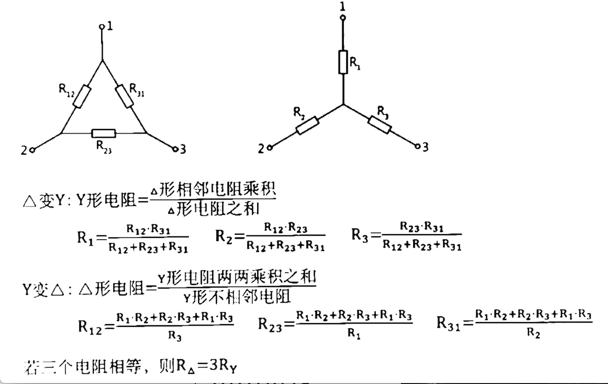
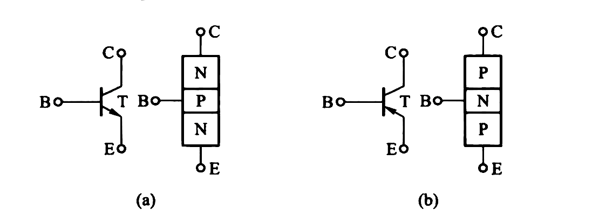

# 电路

[TOC]

## 第一章 直流电流

### 基尔霍夫定律

#### 支路

无分支的一段电路，不包括导线

一个支路中电流相同

#### 结点

三条及以上支路的连接点，一根导线加两个支路只有一个节点

#### 网孔

内部不另含支路的回路

#### KCL

流入和流出任一节点的所有电流的代数和为零

#### KVL

对任一回路，沿着指定的回路绕行方向，各元件两端的电压代数和为零

（`+ -> -` 为正）高压`->`低压

### 单口网络及等效

#### 单口网络（二端网络）

只有一个端口（一对端钮）与外部电路连接的电路。

#### 等效交换

电源：`- -> +` 与电阻相反

1. **电流源并联：** $i_s=\sum_{k=1}^iu_{sk}$

2. **电压源串联：**  $u_s=\sum_{k=1}^nu_{sk}$

3. **电压源与电流源串联：**省略电压源

4. **电压源与电流源并联：**省略电流源

5. **电流源与电阻并联 <-> 电压源与电阻串联**

6. **𝝙-Y等效变换**

$$
R_1=\frac{R_{12} \cdot R_{31}}{R_{12}+R_{23}+R_{31}}
$$

### 支路电流法

以**支路电流**为求解变量的分析方法

#### 求解过程

1. 找出n个**结点**，b条**支路**
2. 标出支路电流方向
3. 根据KCL列出**结点-1**个独立的节点电流方程，回路中的支路不能只有电流源
4. 选定独立回路并指定每个回路的**绕行方向**，再根据KVL列出**支路-结点 +1**个回路电压方程
5. 解出各支路电流

### 结点电压法

适用于**节点少支路多**的电路

任选一**节点**作为参考，将其他节点到参考节点的**电压降**作为该节点的电压。
以**节点电压**为未知量，将各支路电流用节点电压表示，利用**KCL**列出独立电流方程求解。（`+ -> -` 为正）

#### 求解过程

1. 给待求项相关结点标上0，并给其他所有节点标号

2. 将直接与电流源串联的电阻变导线，直接与电压源并联的电阻变断路。让 $G_{nn}=节点n各支路电阻的倒数和$

3. 让$G_{12}=-\frac{1}{连接两结点唯一支路上的电阻}$，让所有非零结点两两直接相连

4. 让$I_{Snn}=\frac{电压源}{所在支路电阻}之和+电流源产生电流之和$（流入结点为正，电压源**由负到正**产生电流），求所有节点

5. 列出方程求解，$U_{10}=结点1到0的电位差$

$$
\left\{
    \begin{array}{c}
     G_{11}U_{10}+G_{12}U_{20}+G_{13}U_{30}=I_{11}\\
     G_{21}U_{10}+G_{22}U_{20}+G_{23}U_{30}=I_{22}\\
     G_{31}U_{10}+G_{32}U_{20}+G_{33}U_{30}=I_{33}
    \end{array}
\right.
$$

### 回路电流法

#### 求解过程

1. 找出n个**结点**，b条**支路**，取**(支路-结点+1)**条回路标号，并指定回路电流绕行方向

2. 令  $R_{nn}=回路n的电阻之和$，求所有回路

3. 令 $R_{12}=R_{21}=回路1和2共有的电阻之和$ （电阻在两回路的电流反向则为负），比较所有电阻

4. 令 $u_{Snn}=回路1中所有电压源之和$ （指定电流方向由 **+ 到 -** 则取**负**）

5. 对每个回路列方程

$$
\left\{
    \begin{array}{c}
     R_{11}i_1 + R_{12}i_2 + R_{13}i_3 = u_{S11}\\
     R_{21}i_1 + R_{22}i_2 + R_{23}i_3 = u_{S22}\\
     R_{31}i_1 + R_{32}i_2 + R_{33}i_3 = u_{S33}\\
    \end{array}
\right.
$$

6. 各支路电流 = 该支路所属回路电流之和

### 叠加定理

由多个独立电源在某一支路产生的电压和电流等于各个**电源独立作用**的代数和

#### 求解过程

1. 找出待求部分，让其**内部**的电压源短路，电流源开路，求出此时`待求部分'`
2. 恢复待求部分，让其**外部**的电压源短路，电流源开路，求出此时`待求部分"`
3. 待求部分=`待求部分'`+`待求部分"`

### 等效电源定理

适用于复杂电路中计算某一**特定支路**的电压或电流

将待求支路看作外电路，其余部分替换为等效电源

#### 戴维南等效电路

任一单口网络，对外电路而言，可用一个理想电压源和一电阻**串联**来等效

1. 用**基尔霍夫电压定律**计算开路电压，计算理想电压源 $U_{oc}$ (接口电压)

2. 可直接电流源开路电压源短路，求开路电阻，或在开路处接上独立电源 $U_s$，令原电路的电压源短路电流源断路，
求出支路上的 $U_s$ 和 $I_s$，$R_{eq}= \frac{U_s}{I_s}$

3. 将电阻 $R_{eq}$ 和电压源 $U_{oc}$ 串联，形成等效电源

#### 诺顿等效电路

任一单口网络，对外电路而言，可用一个理想电流源和一电阻**并联**来等效

1. 用导线连接接口，求接口的导线电流 $I_{sc}$

2. 可直接电流源开路电压源短路，求开路电阻，或在开路处接上独立电源 $U_s$，令原电路的电压源短路电流源断路，求出流经 $U_s$ 的电流 $I_s$，$R_{eq}= \frac{U_s}{I_s}$

3. 将电阻 $R_{eq}$ 和电流源 $I_{sc}$ 并联，形成等效电源

### 求最大功率

1. 拿出可变电阻形成开路，用等效电源定律求出 $u_{oc}$ 和 $R_{eq}$
2. 当 $R_L=R_{eq}$ 时，$P_{max}= \frac{u_{oc}^2}{4R_{eq}}$

### 求 吸收/释放 功率

1. 电阻恒定吸收功率
2. 电源：元件中电流从**高**电压流经**低**电压则吸收功率（电压和电流同向）

## 第二章 一阶动态电路的暂态分析

### 电容元件与电感元件

#### 电容的伏安特性

电容：阻止**电压**突变
$$
u_C=u_v(t_0)+\frac{1}{C}\int^{t}_{t_0}i_C(\tau)d\tau=u_C(\infty)+[u_C(0_+)-u_C(\infty)]e^{-\frac{t-t_0}{\tau}}(\tau=RC)
$$

$$
i_C=\frac{dq}{dt}=C\frac{du_C}{dt}
$$

$$
w_C(t)=\frac{1}{2}Cu_C^2(t)
$$

#### 电感的伏安特性

电感：阻止**电流**突变
$$
i_L=i_L(t_0)+\frac{1}{L}\int^{t}_{t_0}u_L(\xi)d(\xi)=i_L(\infty)+[i_L(0_+)-i_L(\infty)]e^{-\frac{t-t_0}{\tau}}(\tau=\frac{L}{R})
$$

$$
u_L=L\frac{di_L}{dt}
$$

$$
w_L(t)=\frac{1}{2}L~i_L^2(t)
$$

### 换路定则及其初始条件

电路中开关的接通、断开，元件参数的变化统称为换路

时间常数：$\tau = CR$

$0_+$：换路前一瞬间

$0_-$：换路后一瞬间

#### 换路定则

换路时**电容上的电压**，**电感上的电流**不能跃变
$$
u_C(0_+)=u_C(0_-)
$$

$$
i_L(0_+)=i_L(0_-)
$$

#### 初始值的计算

$0_-$ 时，电容=开路，电感=短路

$0_+$ 时，电容=电压源，电感=电流源

### RC电路响应分析（电容）

1. 画出开始状态与变化后状态的电路图
2. 将**电容开路**，求出两状态稳定时电容两端电压 $u_C(0_+)$ 和 $u_C(\infty)$
3. 找出开始突变时间 $t_0$
4. 找出时间常数$\tau=RC$，将**变化后**电路的电压源短路电流源开路，并去掉电容后，电容两端的等效电阻为$R$
5. 套公式 $u_C=u_C(\infty)+[u_C(0_+)-u_C(\infty)]e^{-\frac{t-t_0}{\tau}}(\tau=RC)$   $i_C=C\frac{du_C}{dt}$

### RL电路响应分析（电感）

1. 画出开始状态与变化后状态的电路图
2. 将**电感短路**，求出两状态稳定时电感两端电流 $i_L(0_+)$ 和 $i_L(\infty)$
3. 找出开始突变时间 $t_0$
4. 找出时间常数 $\tau=\frac{L}{R}$，将**变化后**电路的电压源短路电流源开路，并去掉 电感后，电容两端的等效电阻为$R$
5. 套公式 $i_L=i_L(\infty)+[i_L(0_+)-i_L(\infty)]e^{-\frac{t-t_0}{\tau}}(\tau=\frac{L}{R})$   $u_L=L\frac{di_L}{dt}$

### 一阶电路响应

|    名称    | 开始 | 后来 |
| :--------: | :--: | :--: |
| 零输入响应 | 通电 | 断电 |
| 零状态响应 | 断电 | 通电 |
|   全响应   | 通电 | 通电 |

## 第三章 正弦稳态电路

### 正弦交流电的基本概念

$$
u=U_msin(\omega t + \varphi)~~~(\varphi 左加右减)
$$

$$
i=I_msin(\omega t + \varphi)~~~(\varphi 左加右减)
$$

$$
\omega t=2\pi ft=\frac{2\pi t}{T}
$$

### 交流变量相加

$$
i=I_msin(\omega t + \varphi)
$$

$$
\dot I=\frac{I_m}{\sqrt2}(cos\varphi+sin\varphi \cdot j)=a+bj
$$

$$
i=\sqrt2 \cdot \sqrt{a^2+b^2}sin(\omega t+\theta)~~~(tan\theta=\frac{b}{a})
$$

### 交流变量乘除

$$
\dot{I}=\frac{I_m}{\sqrt2} \ang\varphi~~~~~\dot{U}=\frac{U_m}{\sqrt2}\ang\varphi
$$

$$
Z=a+bj=\sqrt{a^2+b^2}\ang\theta~~~(tan\theta=\frac{b}{a})
$$

$$
\frac{x\ang\varphi_1}{y\ang\varphi_2}=\frac{x}{y}\ang(\varphi_1-\varphi_2)
$$

$$
x\ang\varphi_1 \cdot y\ang\varphi_2=xy\ang(\varphi_1+\varphi_2)
$$

### 三种基本元件的阻抗

| 元件  | 电阻 |    电感     |         电容          |    感抗    |         容抗         |
| :---: | :--: | :---------: | :-------------------: | :--------: | :------------------: |
| $Z$值 | $R$  | $\omega Lj$ | $\frac{-j}{\omega C}$ | $\omega L$ | $\frac{1}{\omega C}$ |

### 相量图

**电流经过$R$**：$\dot{U}_R$与$\dot {I}$相向

**电流经过$L$**：$\dot{U}_L$与$\dot {I}$超前90度(感压超前：逆时针)

**电流经过$C$**：$\dot{U}_C$与$\dot {I}$滞后90度(容压滞后：顺时针)

### 正弦稳态电路的功率

#### 有功功率

**纯电阻**只有**有功**功率
$$
有功功率:P =
\left\{
    \begin{array}{c}
	UIcos\varphi\\\\
	\frac{U^2}{|Z|}cos\varphi\\\\
	I^2|Z|cos\varphi
	\end{array}
\right.
$$

#### 无功功率

**纯电感**和**纯电容**只有**无功**功率
$$
无功功率:Q =
\left\{
    \begin{array}{c}
	UIsin\varphi\\\\
	\frac{U^2}{|Z|}sin\varphi\\\\
	I^2|Z|sin\varphi
	\end{array}
\right.
$$

#### 功率因数

$$
tan\varphi = \frac{Q_总}{P_总}
$$

#### 视在功率

$$
S_N=\sqrt{P^2+Q^2}
$$

#### 复功率
$$
\overline S=P+jQ
$$

## 第四章 模拟集成运算放大器

[放大电路分析](https://www.bilibili.com/video/BV1BK41177Pn?p=4)

[康华光模电精讲](https://www.bilibili.com/video/BV18t411M7pZ?p=2)

### 集成运算放大电路模型

差模输入电压：$u_{id} = u_{i+}-u_{i-}$

开环放大倍数：$A_{uo}$

#### 虚断路（理想化）

$$
R_i \to \infty\\
R_o \to 0\\
A_{uo} \to \infty\\
I_{i+} = I_{i-} = 0
$$

#### 虚短路（理想化）

$$
u_{i+} = u_{i-}\\
u_{id}=0
$$

### 运算放大器电压传输特性

线性放大区（虚短路）：$u_o = A_{uo}(u_{i+}-u_{i-}) = A_{uo}u_{id}$

限幅区：$u_o = U_{CC}~或~u_o= U_{EE}$

### 反向电压传输特性

扩大线性区——引入负反馈

$$
u_id = \frac{R_2}{R_1+R_2}u_i+\frac{R_1}{R_1+R_2}u_o\\
u_o = -\frac{R_2}{R_1}u_i
$$

#### 负反馈

将反馈信号引向反相输入端

使反馈信号抵消部分输入信号

保证在输入信号较大时，$U_{id}$ 仍然很小，且在“虚短路”范围内

从而集成运算放大器工作在线性放大区

## 第五章 半导体二极管及其直流稳压

#### 二极管的特征

#### N型半导体

在硅晶体中掺入五价元素磷

#### P型半导体

在硅晶体中掺入三价元素硼

#### PN结

正极接P，负极接N，低电阻，导通

**死区电压**：正向电压很小时，正向电流激增

**击穿电压**：反向电压很大时，反向电流锐减

### 二极管电路分析

#### 判断导通

1. 断开二极管，断点的电压参考方向与二极管一致
2. 根据电路分析电压差
3. 电压差大于0则导通，反之截止
4. 若两管均满足导通条件，则**压差大者优先导通**

#### 恒压降模型

### 直流稳压电源

1. 变压
2. 整流
3. 滤波
4. 稳压

## 第六章 晶体三极管及其放大电路

### 三极管基本结构

基极B

发射极E

集电极C

##### 发射结

基区和发射区之间的结

##### 集电结

基区和集电区之间的结

### 晶体管的类型

### 三极管类型判断

1. 中间电位为**基极B**
2. 
	- **硅管**：与基极B相差**0.7**为发射极E
	- **锗管**：与基极B相差**0.3**为发射极E
3. 
	- **NPN**：**集电极C**电位最**高**
	- **PNP**：**集电极C**电位最**低**
4. 电流方向与**集电极C**相比较

### 晶体管放大的外部条件

发射结正偏、集电结反偏

### 三极管基本知识

#### 1. 电流特性

三极管处于放大区时：

$$
I_E=I_B+I_C\\
\overline{\beta}=\frac{I_C}{I_B}
$$

#### 2. 放大电路画法

#### 直流通路

电容开路

交流信号源短路

#### 交流通路

电容短路

直流电压源短路

#### 3. 参数等效模型

三极管可等效为电阻 $r_{be}$ 与可变电流源 $i_c$

### 下标大小写

交流：$u_i$

直流：$U_I$

混合：$u_I$

### 放大电路的分析

#### 静态分析

##### 静态工作点（Q）

静态工作点选择不合适导致电路失真

对未失真的电路进行动态分析

$$
I_{EQ}=I_{CQ}+I_{BQ}\approx I_{CQ}\\
r_{be}=r_{bb'}+(1+\beta) \frac{U_T}{I_{EQ}}
$$

### 基本放大电路

#### 直流分析

 $I_{BQ} \to I_{CQ} \to U_{CEQ}$

1. 画出直流通路，电容开路，交流信号源短路

2. $V_{CC}$ 接地连通，由 KVL 求得 $I_{BQ}$

3. $I_{CQ}=\beta I_{BQ}$

4. 由 KVL 求出 $U_{CEQ}$

#### 交流分析

1. 画出交流通路，电容短路，直流电压源短路，**$V_{CC}$ 接地**

2. 将三极管等效，be等效为电阻 $r_{be}$ ，ce等效为可变电流源 $i_c$

3. 求解

由 KVL 求得：

$$
\begin{align}

u_o&=-i_c \cdot R_c\\
u_i&=i_b \cdot R_b + i_b \cdot r_{be}

\end{align}
$$

- 放大倍数 $\dot{A_u}$：

$$
\dot{A_u}=\frac{u_o}{u_i}=\frac{-i_c \cdot R_c}{i_b(r_b+r_{be})}
=\frac{-\beta R_c}{R_b+r_{be}}
$$

- 输入电阻 $R_i$：

$$
R_i=\frac{u_i}{i_i}=\frac{i_b(R_b+r_{be})}{i_b}=R_b+r_{be}
$$

- 输出电阻 $R_o$：

$$
R_o=\frac{u_o}{i_o}=\frac{u_o}{u_o / R_c}=R_c
$$

### 阻容耦合放大电路

#### 直流分析

$I_{BQ} \to I_{CQ} \to U_{CEQ}$

1. 画出直流通路，电容开路，交流信号源短路

2. $V_{CC}$ 接地连通，由 KVL 求得 $I_{BQ}$

$$
V_{CC}-I_{BQ} \cdot R_{b}-U_{CEQ}=0
$$

3. $I_{CQ}=\beta I_{BQ}$

4. 由 KVL 求得 $U_{CEQ}$

$$
V_{CC} - I_{CQ} \cdot R_c - U_{CEQ} = 0
$$

#### 交流分析

1. 画出交流通路，电容短路，直流电压源短路，**$V_{CC}$ 接地**

2. 将三极管等效，be等效为电阻 $r_{be}$ ，ce等效为可变电流源 $i_c$

3. 注意划定输入输出电阻范围，求解

- 放大倍数 $\dot{A_u}$：

$$
\dot{A_u}=\frac{u_o}{u_i}=\frac{-i_c \cdot (R_c//R_L)}{i_b \cdot r_{be}}
=\frac{-\beta (R_c//R_L)}{r_{be}}
$$

- 输入电阻 $R_i$：

$$
R_i=\frac{u_i}{i_i}
=\frac{u_i}{\frac{u_i}{R_b}+\frac{u_i}{r_{be}}}
=r_{be}//R_b
=\frac{r_{be}\cdot R_b}{r_{be} + R_b}
$$

- 输出电阻 $R_o$：

$$
R_o=R_c
$$

### 共集电极放大电路

1. 
$$
\dot{A_u}=\frac{u_o}{u_i}=\frac{(1+\beta) {R_L}'}{r_{be}+(1+\beta) {R_L}'}=1\\
$$

2. $R_i$ 高
3. $R_o$ 低

### 共基极放大电路

1. $R_i$ 低
2. 可运用在更高电源电压下
3. 高频特性更优越

### 静态工作点稳定电路

## 第七章 场效应管及其放大电路

### 基本结构

共源极S：共射极

共漏极D：共集电极

共栅极G：共基极

### 概念

#### FET的直流偏置要求

##### JFET

加入栅源电压后保证栅源之间的PN结反偏

##### 增强型MOS管

加入栅源电压后，使衬底的多子受到排斥

##### 耗尽型MOS管

栅源电压正偏、零偏、反偏均能工作

### 直流偏置电路

#### 自给偏压

##### 栅极电阻 $R_G$ 作用

为栅偏压提供通路和泻放栅极积累电荷

##### 源极电阻 $R_S$ 作用

提供负栅偏压

##### 源极电阻 $R_D$ 作用

把 $i_D$ 的变化转变为 $u_{DS}$ 的变化

### 静态分析

$I_{DQ} \to U_{GSQ} \to U_{DSQ}$

1. 画出直流通路，电容开路，交流信号源短路

2. 由栅源回路 KVL 得 $U_{GSQ} = -I_{DA}R_S$

3. $I_G = 0$，$V_{CC}$ 接地连通，由漏源回路 KVL 求得 $I_{BQ}$

$$
U_{DSQ} = V_{DD} - I_{DQ}R_D-I_{DQ}R_S
$$
$$
I_{DQ}=I_{DSS}(1-\frac{U_{GSQ}}{U_{GS}})^2
$$

### 动态分析

1. 画出交流通路，电容短路，直流电压源短路，**$V_{CC}$ 接地**

2. 画出微变等效电路，GS断开且电位差为 $u_{gs}$，
DS等效为可变电流源 $g_m u_{gs}$

3. 注意划定输入输出电阻范围，求解

$$
g_m = \frac{di_D}{du_{GS}}
$$

- 放大倍数 $\dot{A_u}$：

$$
\dot{A_u}=\frac{u_o}{u_i}=\frac{-g_m U_{gs} (R_D//R_L)}{U_{gs}}
=-g_m R_L'
$$

- 输入电阻 $R_i$：

$$
R_i=\frac{u_i}{i_i}
=R_{G_3} + R_{G_1}//R_{G_2}
$$

- 输出电阻 $R_o$：

$$
R_o=\frac{u_o}{i_o}
$$

## 第八章 低频功率放大电路

### 频率响应的基本概念

#### 幅频与相频

$ \dot{A_u} = A_u(f) \ang \varphi(f)$

幅频特性：$A_u(f)$

相频特性：$\varphi(f)$

#### 波特图

1. 幅频特性和相频特性的**横坐标**都采用**对数刻度**以扩大表示范围

2. **幅频**特性纵轴上的幅值也用**对数**表示为
$201g|A_u|$ 单位是分贝（dB)

3. **相频**特性的纵坐标仍采用**角度**表示

## 第九章 负反馈放大电路

## 第十章 信号产生与处理电路

## 各放大电路优缺点

