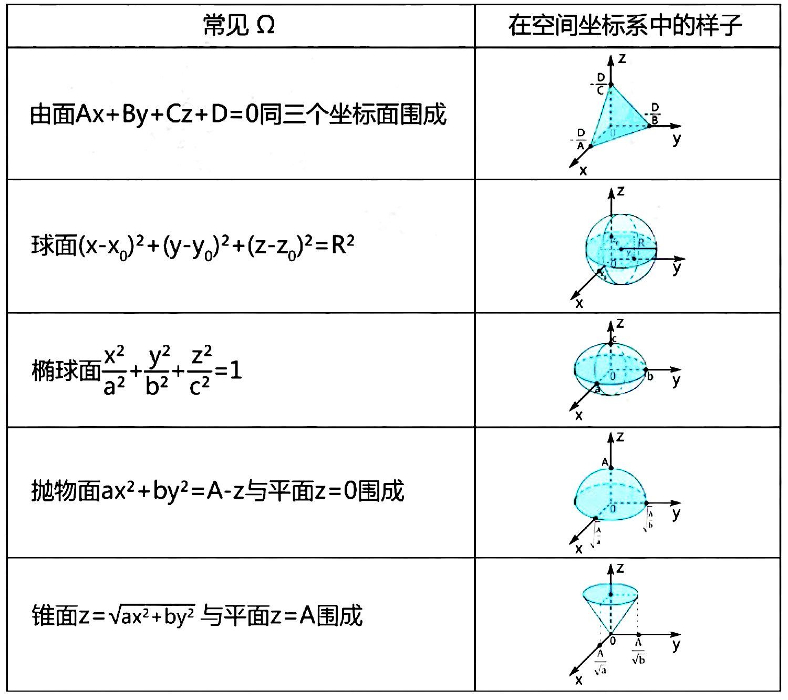
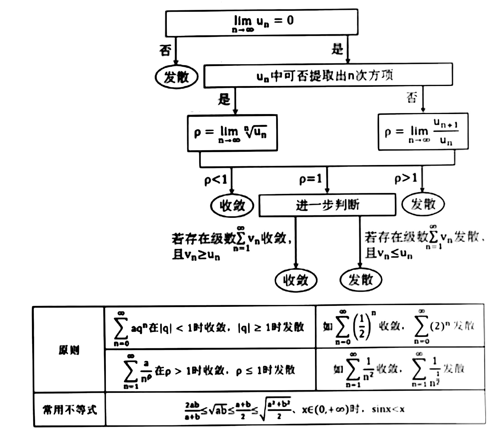

# 高数2

## 第八章  向量代数与空间解析几何

### 向量及其线性运行

#### 向量的概念

##### 共面

设有k个向量，当把它们的起点放在同一点时，k个终点和公共起点在同一平面。

#### 向量的线性运算

向量的加法及数乘向量统称为向量的**线性运算**

#### 方向余弦

$$
\vec{e_\tau}=(cos\alpha,cos\beta,cos\gamma)=\frac{\vec{\tau}}{|\vec{\tau}|}
$$

### 数量积和向量积

#### 数量积

$\vec a \cdot \vec b$

#### 数量积的性质

1. $\vec a \cdot \vec a=|\vec a|^2$
2. $\vec{a}\cdot\vec{b}=0~\Leftrightarrow~\vec{a}\perp \vec{b}$

#### 向量积

$|\vec{c}|=|\vec{a}||\vec{b}|sin\theta$

$\vec{c}$ 的方向由右手规则求得

#### 向量积的计算

$$
\vec a \times \vec b=
\left\|
	\begin{array}{c}
		i~~~~~j~~~~~k\\
		a_x~~~a_y~~~a_z\\
		b_x~~~b_y~~~b_z
	\end{array}
\right\|
=(a_yb_z+z_zb_y,~a_zb_x+a_xb_z,~a_xb_y+a_yb_x)
$$

#### 向量积性质

1. $\vec{a}\times\vec{a}=|\vec{a}|^2sin0=\vec 0$

2. $\vec{a}\times\vec{b}=\vec{0}~\Leftrightarrow~\vec{a}~//~\vec{b}$

### 平面及其方程

#### 点法式

$$
n\cdot\vec{MM_0}=A(x-x_0)+B(y-y_0)+C(z-z_0)=0
$$

#### 一般式

$$
Ax+By+Cz+D=0
$$

#### 截距式

$$
\frac{x}{a}+\frac{y}{b}+\frac{z}{c}=1
$$

#### 点到平面距离

$$
\begin{align}
	d&=|Prj_{\vec n}P_0P|=\frac{|\vec{P_0P} \cdot \vec n|}{|\vec n|}~~~(P为平面内任意一点)\\\\
	&=\frac{|Ax_0+By_0+Cz_0+D|}{\sqrt{A^2+B^2+C^2}}	
\end{align}
$$

### 空间直线及其方程

#### 一般式

注：直线的一般方程并**不唯一**
$$
\left\{
	\begin{array}{c}
		A_1x+B_1y+C_1z+D_1=0\\
		A_2x+B_2y+C_2z+D_2=0
	\end{array}
\right.
$$

#### 点向式

$$
\vec{M_0M}~//~(m,n,p)\Rightarrow\frac{x-x_0}{m}=\frac{y-y_0}{n}=\frac{z-z_0}{p}
$$

#### 参数方程

$(m,n,p)$ 为方向数
$$
\left\{
	\begin{array}{c}
		x=x_0+mt\\
		y=y_0+nt\\
		z=z_0+pt
	\end{array}
\right.
$$

#### 平面束方程

有直线的一般式得：

$$
A_1x+B_1y+C_1z+D_1+\lambda(A_2x+B_2y+C_2z+D_2)=0
$$

### 曲面及其方程

#### 曲面研究的基本问题

#### 旋转曲面 

#### 柱面 

#### 二次曲面 

### 空间曲线及其方程

#### 空间曲线的一般方程

两曲面的交线:

$$
\left\{
	\begin{array}{c}
		F(x,y,z)=0\\
		G(x,y,z)=0
	\end{array}
\right.
$$

#### 空间曲线的参数方程

$$
\left\{
	\begin{array}{c}
		x=x(t)\\
		y=y(t)\\
		z=z(t)
	\end{array}
\right.
$$

#### 空间投影

##### 两直线投影

$$
Prj_{\vec{b}} \vec a=\frac{\vec{a} \cdot \vec{b}}{|\vec{b}|}
$$

##### 点到平面的投影

1. 联立平面法向量与点，得到垂线
2. 求垂线与平面交点

$$
\left\{
	\begin{array}{c}
		\frac{x-x_0}{A}=\frac{y-y_0}{B}=\frac{z-z_0}{C}=k\\
		Ax+By+Cz+D=0
	\end{array}
\right.
$$

##### 点到平面的投影

1. 过 $M_0$ 作垂直与 $l$ 的平面
2. 求线与面的交点

$$
\left\{
	\begin{array}{align}
	&\frac{x-x_0}{m}=\frac{y-y_0}{n}=\frac{z-z_0}{p}\\
	&m(x-x_0)+n(y-y_0)+p(z-z_0)=0
	\end{array}
\right.
$$

##### 直线到平面的投影？？？

##### 曲面到坐标轴的投影
$$
\left\{
	\begin{array}{c}
		H(x,y)=0\\
		z=0\\
	\end{array}
\right.
$$

## 第九章 多元函数微分法及其应用

### 多元函数

#### 平面点集

##### 领域

$$
U(P_0)=U(P_0,\delta)={(P~\big|~0<|PP_0|<\delta)}
$$

##### 边界点

如果点 $P$ 的任一邻域内都既含有属于$E$ 的点，又含有不属于$E$ 的点，那么称 $P$ 为$E$ 的边界点。

##### 聚点

如果对于任意给定的 $\delta>0$ ，点 $P$ 的去心邻域 $\mathring{U}(P,\delta)$ 内总有$E$ 中的点，那么称 $P$ 是$E$ 的聚点。 (点集$E$ 和边界 $\partial E$ 上的所有点)

##### 开集

点集 $E$ 的点都是 $E$ 的内点

##### 闭集

点集 $E$ 的边界 $\partial E \subset E$

##### 联通集

点集 $E$ 内任何两点可以通过属于 $E$ 的折线联结

##### 区域

联通的**开集**

##### 闭区域

开区域连同它的边界

#### 多元函数的概念

##### 自然定义域

使等式有意义的 $x$ 的集合

##### 二元函数的图形

$$
z = f(x,y) \Leftrightarrow M(x,y,x)
$$

二元函数的图形是空间曲面

#### 多元函数的极限

$$
\lim \limits_{(x,y) \to (x_0,y_o)}f(x,y)=A
$$

#### 多元函数的连续性

如果$ \lim \limits_{(x,y) \to (x_0,y_0)} = f(x_0,y_0)$ ，则$f(x,y)$ 在点 $P_0(x_0,y_0)$连续

##### 介值定理

在有界闭区域 $D$ 上的多元连续性函数必取得介于最大值和最小值之间的**任何值**

### 偏导数

#### 偏导数的定义及其计算方法

##### 偏导数

$$
\frac{\partial f}{\partial x}\bigg|_{(x_0,y_0)}= f'_x(x_0, y_0)=\lim \limits_{\Delta x \to 0} \frac{f(x_0 + \Delta x, y_0) - f(x_0, y_0)}{\Delta x}
$$

##### 偏导函数

对于每一点 $(x,y)$ 处的偏导数都存在

##### 求法

求 $\frac{\partial f}{\partial x}$ ，**将 $y$ 当作常数**，用一元求导法，对 $x$ 求导。  

#### 高阶偏导数

高阶混合偏导数在**偏导数连续**的条件下与求导次序无关。

$$
\frac{\partial^2 z}{\partial x \partial y}=\frac{\partial{(\frac{\partial z}{\partial x})}}{\partial y}=\frac{\partial^2 z}{\partial y \partial x}
$$

### 全微分

#### 全微分的定义

##### 偏增量

$$
f(x,y+\Delta y)-f(x,y)
$$

##### 偏微分

$$
f'_y(x,y) \Delta y
$$

##### 全增量

$$
\Delta z = f(x+\Delta x,y+\Delta y)-f(x,y)
$$

##### 全微分

$$
dz=A \Delta x + B \Delta y\\
A = \frac{\partial z}{\partial x}~~~B = \frac{\partial z}{\partial y}
$$

##### 证明可微⚠️

$\Delta z - dz = o(p)$ ，$p=\sqrt{(\Delta x)^2+(\Delta y)^2}$ ， $o(p)$ 为高阶无穷小

即证：

$$
\lim \limits_{\Delta x \to 0\Delta y \to 0} \frac{\Delta z-(\frac{\partial z}{\partial x} \Delta x + \frac{\partial z}{\partial y} \Delta y)}{p}=0
$$

**偏导存在 + 连续 -> 全微分存在 => 偏导连续**

### 多元复合函数的求导法则

#### 一元函数与多元函数复合

$z=f(\varphi(t),~\psi(t))$

$$
\frac{dz}{dt}=\frac{\partial z}{\partial u}\cdot \frac{\partial u}{\partial t}+\frac{\partial z}{\partial v}\cdot \frac{\partial v}{\partial t}
$$

#### 多元函数与多元函数复合

$z=f(\varphi(x,y),~\psi(x,y))$

$$
\frac{\partial z}{\partial x}=\frac{\partial z}{\partial u}\cdot \frac{\partial u}{\partial x}+\frac{\partial z}{\partial v}\cdot \frac{\partial v}{\partial x}
$$

$$
\frac{\partial z}{\partial y}=\frac{\partial z}{\partial u}\cdot \frac{\partial u}{\partial y}+\frac{\partial z}{\partial v}\cdot \frac{\partial v}{\partial y}
$$

#### 多元隐函数求导

$$
\frac{\partial y}{\partial x}
= -\frac{F'_x}{F'_y}
= -\frac{\frac{\partial F}{\partial x}}
{\frac{\partial F}{\partial y}}
$$

### 多元函数微分学的几何应用

#### 曲面的切平面和法线

$$
F(x,y,z)=0
$$

##### 法向量

$$
\vec n = \{F'_x,F'_y,F'_z\}
$$

##### 法线

$$
\frac{x-x_0}{F'_x}=\frac{y-y_0}{F'_y}=\frac{z-z_0}{F'_z}
$$

##### 切平面

$$
F'_x(x-x_0)+F'_y(y-y_0)+F'_z(z-z_0)=0
$$

#### 曲线的切线与法平面

$$
\left\{
	\begin{array}{c}
		x=\varphi(t)\\
		y=\psi(t)\\
		z=\omega(t)
	\end{array}
\right.
$$

##### 切向量

$$
\vec{T}=\{\varphi'(t),~\psi'(t),~\omega'(t)\}=\{1,~\frac{dy}{dx},~\frac{dz}{dx}\}
$$

##### 切线

$$
\frac{x-x_0}{\varphi'(t_0)}=\frac{y-y_0}{\psi'(t_0)}=\frac{z-z_0}{\omega'(t_0)}
$$

##### 法平面
$$
\varphi'(t_0)(x-x_0)+\psi'(t_0)(y-y_0)+\omega'(t_0)(z-z_0)
$$

### 方向导数与梯度

#### 方向导数

函数沿着某一个方向变化速度的快慢
$$
\vec e_l=\frac{\vec l}{|\vec l|}=(cos\alpha,cos\beta)\\
\frac{\partial z}{\partial l}=(\frac{\partial z}{\partial x},\frac{\partial z}{\partial y})\cdot \vec e_l=\frac{\partial z}{\partial x}cos\alpha+\frac{\partial z}{\partial y}cos\beta
$$
#### 梯度

一个函数，沿不同方向变化快慢不同， 其中最快的方向为**梯度方向**，最大值为梯度的模

（当 $\theta=0$，即方向 $\vec{e_l}$ 与梯度 $gradf(x_0,y_0)$ 方向相同时，函数 $f(x,y)$ 增加最快）
$$
gradf=(\frac{\partial f}{\partial x},\frac{\partial f}{\partial y},\frac{\partial f}{\partial z})\\
\vec l= (x,y,z)~~~~~\vec{e_l}=(\frac{x}{l},\frac{y}{l},\frac{z}{l})\\
\frac{\partial f}{\partial l}\bigg|_{max}=|gradf|=gradf(max)\cdot \vec{e_l}
$$

### 多元函数的极值

#### 无条件极值和最值

##### 无条件极值

$z = f(x,y)$ 在 $D$ 内的极值

###### 1. 求驻点
$$
\left\{
	\begin{array}{c}
		f'_x=0\\
		f'_y=0
	\end{array}
\right.
$$

###### 2. 求极值

（代入驻点）

$$
A = f''_{xx}~~~~~B = f''_{xy}~~~~~C = f''_{yy}
$$

|            |          |
| :--------: | :------: |
| $AC-B^2>0$ |  有极值  |
| $AC-B^2<0$ |  无极值  |
| $AC-B^2=0$ | 无法判断 |

###### 3. 求极值

$A > 0$：极小值

$A < 0$：极大值

##### 最值

###### 1. 求出两个偏导为0的解

$$
\left\{
	\begin{array}{c}
		f'_x=0\\
		f'_y=0
	\end{array}
\right.
$$

###### 2. 作图找出定义域边界

###### 3. 将解和边界方程代入原函数

###### 4. 若3的结果为式子，则求改式最值

###### 5. 在2、3、4的数值结果中求最值

#### 条件极值 拉格朗日乘数法

##### 有条件极值

$z = f(x,y)$ 在 $\varphi(x, y)=0$ 条件下的极值

###### 目标函数

$z = f(x, y)$

###### 约束条件

$\varphi(x, y)=0$

###### 求解方法(拉格朗日乘数法)

1. $F(x, y, \lambda) = f(x, y) + \lambda \varphi (x, y)$

2. 求驻点

$$
\left\{
  \begin{array}{c}
    F_x&=0\\
    F_y&=0\\
    \varphi(x, y)&=0
  \end{array}
\right.
$$
3. 用驻点求解极大值和极小值

## 第十章 重积分

### 二重积分的概念与性质

#### 二重积分的概念

$$
\lim \limits_{\lambda \to 0}\sum \limits_{i=1}^n 
f(x_i, y_i)\Delta \sigma_i
=\iint \limits_{Dxoy} f(x, y) d\sigma
$$

#### 二重积分的性质

1. 保号性

$$
f(x,y) \le g(x,y) \Rightarrow
\iint \limits_Df(x, y)d\sigma \le \iint \limits_Dg(x,y)d\sigma
$$
2. 保号性的特殊情形

$$
\bigg|\iint \limits_Df(x, y)d\sigma\bigg| \le
\iint \limits_D | f(x, y) | d\sigma
$$
3. 介值定理

$$
\frac{1}{\sigma} \iint \limits_D f(s, y) d\sigma
=f(\xi, \eta)
$$

### 二重积分的计算

#### 直角坐标

##### $\int dx \int dy$

1. 把未知数集中到后面
$$
\int_a^b xdx \int_c^d ydy
\Rightarrow \int_a^b \int_c^d xydy dx
$$

2. 依次向前积分
$$
\int_a^b \int_c^d xydy dx
\Rightarrow \int_a^b dx \big(\frac{1}{2} x y^2\big)\bigg|^d_c
$$

##### 交换积分次序

1. 把未知数集中到后面

2. 根据上下限，画出积分区域

3. 在积分区域的函数里用自变量表示因变量

4. 在重合部分不变的情况下，重新划分边界（注意y的边界是否随x变化）

5. 重新赋值积分的上下界

##### $\iint \limits_D d \sigma$

1. 画出积分区域

2. 列出边界方程

3. 保留被积函数，将 $\sigma$ 改成 $dxdy$

4. 根据第2步写出上下限

5. 将边界为数字的放在最前面

#### 极坐标

$$
x=\rho cos\theta~~~~~y=\rho sin\theta~~~~~dxdy=\rho \cdot d\theta d\rho
$$

##### 与圆有关的二重积分

1. 将方程化为极坐标方程

2. 作图，用 $\rho$ 和 $\theta$ 划定上下限

3. 将边界为数字的放在最前面

#### 积分区域对称的二重积分

##### 若关于y对称(-x)

$$
\begin{align}

f(-x,y)=-f(x,y)&\Rightarrow
\iint \limits_D f(x, y) d\sigma = 0\\
f(-x,y)=f(x,y) &\Rightarrow
\iint \limits_D f(x, y) d\sigma =
2\iint \limits_{\frac{D}{2}} f(x, y) d\sigma

\end{align}
$$

##### 若关于x对称(-y)

$$
\begin{align}

f(x,-y)=-f(x,y)&\Rightarrow
\iint \limits_D f(x, y) d\sigma = 0\\
f(x,-y)=f(x,y) &\Rightarrow
\iint \limits_D f(x, y) d\sigma =
2\iint \limits_{\frac{D}{2}} f(x, y) d\sigma

\end{align}
$$

##### 若关于原点对称

$$
\begin{align}

f(-x,-y)=-f(x,y)&\Rightarrow
\iint \limits_D f(x, y) d\sigma = 0\\
f(-x,-y)=f(x,y) &\Rightarrow
\iint \limits_D f(x, y) d\sigma =
2\iint \limits_{\frac{D}{2}} f(x, y) d\sigma

\end{align}
$$

### 三重积分

#### 三重积分的概念

体积元素的三重积分是体积

#### 三重积分的计算

1. 结合表，表示出 $\Omega$ ，
并**以 $z$ 为因变量列方程，表示出上下曲面**

2. 求解 $g(x,y) = \int_{下表面}^{上表面} f(x,y,z)dz$

3. 求出 $\Omega$ 在 $xoy$ 的投影 $D$

4. $\iint \limits_D g(x,y) d\sigma$ 为所求

### 重积分的应用

#### 曲面面积

#### 质心

#### 转动惯量

#### 引力

## 第十一章 曲线积分与曲面积分

### 对弧长的曲线积分

#### 概念与性质

被积函数为**标量**，如密度

被积函数是曲线的线密度

积分是曲线的质量

#### 计算方法

##### 弧度相关

$$
\int \limits_L f(x, y) ds
=\int_\alpha^\beta f[x(\theta),y(\theta)] \cdot
\sqrt{[x'(\theta)]^2 + [y'(\theta)]^2} d\theta
$$

##### 可以用x表示y

$$
\int \limits_L f(x, y) ds
=\int_a^b f[x,y(x)] \cdot
\sqrt{1^2 + [y'(x)]^2} dx
$$

##### 对称

1. $\int \limits_ L 1 ds = L的长度$

2. L 关于 x 轴对称

$$
\begin{align}

f(-x,y)=-f(x,y)&\Rightarrow
\int \limits_L f(x, y) ds = 0\\
f(-x,y)=f(x,y) &\Rightarrow
\int \limits_L f(x, y) ds =
2\int \limits_{\frac{L}{2}} f(x, y) ds

\end{align}
$$

2. L 关于 y 轴对称

$$
\begin{align}

f(x,-y)=-f(x,y)&\Rightarrow
\int \limits_L f(x, y) ds = 0\\
f(x,-y)=f(x,y) &\Rightarrow
\int \limits_L f(x, y) ds =
2\int \limits_{\frac{L}{2}} f(x, y) ds

\end{align}
$$

### 对坐标的曲线积分

$$
\int \limits_L P(x, y)dx + Q(x, y)dy
$$

#### 概念与性质

被积函数为**矢量**，如力

被积函数为每个点的力

积分为变力沿曲线所做的功

#### 计算方法

##### 弧度相关

$x’(\theta)来自L$
$$
\int \limits_L P(x, y)dx + Q(x,y)dy
=\int^\beta_\alpha(P[x(\theta), y(\theta)]\cdot x'(\theta) +
Q([x(\theta),y(\theta)]\cdot y'(\theta))dt
$$

##### 可以用x表示y

$y’(x)来自L$
$$
\int \limits_LP(x,y)dx + Q(x,y)dy
= \int^b_a(P[x,y(x)]+Q[x,y(x)]\cdot y'(x))dx
$$

##### 利用性质

当 $\frac{\partial Q}{\partial x}=\frac{\partial P}{\partial y}$：
积分与路径无关

当L为正向(逆时针)无交叉闭曲线，且P、Q在L围成的区域内有连续的一阶偏导：
$$
\oint \limits_L Pdx + Qdy = \iint \limits_D (\frac{\partial Q}{\partial x} -\frac{\partial P}{\partial y})dxdy
$$

当L为逆向(顺时针)无交叉闭曲线，且P、Q在L围成的区域内有连续的一阶偏导：
$$
\oint \limits_L Pdx + Qdy = -\iint \limits_D (\frac{\partial Q}{\partial x} -\frac{\partial P}{\partial y})dxdy
$$

### 两类曲线积分的联系 ???

### 格林公式

#### 概念

当 D 由光滑曲线 L 围成：
$$
\iint \limits_D(\frac{\partial Q}{\partial x}
-\frac{\partial P}{\partial y}) dxdy = \oint_L P(x,y)dx + Q(x,y)dy
$$

#### 曲线积分与路径无关的条件

$$
\frac{\partial Q}{\partial x}
-\frac{\partial P}{\partial y}
$$

#### 二元函数的全微分求积

### 对面积的曲面积分

#### 概念与性质

被积函数为**标量**，如密度

#### 计算方法

##### $\Sigma:z=z(x,y)$

$$
\iint \limits_{\Sigma} f(x,y,z) 
=\iint \limits_D f[x,y,z(x,y)] 
\cdot \sqrt{1 + (\frac{\partial z}{\partial x})^2
+ (\frac{\partial z}{\partial y})^2 } \cdot dx dy
$$

1. 画出 $\Sigma$ ，并表示出 $\Sigma$ 在 xoy 的投影 D

2. 将 $\Sigma$ 表示成 z = z (x, y) 的形式

3. 求出 $f(x, y, z(x, y))~,~\frac{\partial z}{\partial x}~,
~\frac{\partial z}{\partial y}$

4. 代入公式，求出答案

##### $\Sigma:x=x(y, z)$

由 z 转换

##### $\Sigma:y=y(x, z)$

由 z 转换

### 对坐标的曲面积分

#### 概念与性质

被积函数为**矢量**，如力

#### 计算方法

##### $\iint \limits_{\Sigma} P(x, y, z) dydz$

从 x 正半轴向原点看去：

1. 曲面朝向眼睛
$$
\iint \limits_{\Sigma} P(x, y, z)dydz =
\iint \limits_D P[x(y, z), y, z]dydz
$$

2. 曲面背离眼睛
$$
\iint \limits_{\Sigma} P(x, y, z)dydz =
-\iint \limits_D P[x(y, z), y, z]dydz
$$

3. 曲面缩为曲线
$$
\iint \limits_{\Sigma} P(x, y, z)dydz = 0
$$

### 两类曲线积分的联系

### 高斯公式

### 斯托克斯公式

## 第十二章

### 判断函数敛散性

#### 正项级数 $\sum \limits_{n}^{\infty}u_n$

#### 交错级数 $\sum \limits_{n}^{\infty}(-1)^nu_n$

- 末项 != 0 **发散**

- 末项 = 0

	- $|u_n| < |u_{n+1}| $ **发散** 

	- $|u_n| > |u_{n+1}| $ **收敛** 

#### 判断绝对收敛和条件收敛

##### 正项级数

收敛则 **绝对收敛**

##### 交错级数

先取每项的绝对值，转化为正项级数

- 正项级数收敛 **绝对收敛**

- 正项级数发散 **条件收敛**

### 幂级数

#### 根据某一点的敛散性判断另一点

1. 若 $\sum \limits^{\infty}_{n=0}a_n(x+b)^n$ 在 $x = x_0$ 处**收敛**，
则当 $|x + b| < |x_0 +b|$ 时，幂级数在 x 处**绝对收敛**
2. 若 $\sum \limits^{\infty}_{n=0}a_n(x+b)^n$ 在 $x = x_0$ 处**发散**，
则当 $|x + b| > |x_0 + b|$ 时，幂级数在 x 处**发散**

#### 求幂级数的收敛域

$$
1. \bigg|\lim\limits_{n \to \infty} \frac{u_{n+1}}{n_n}\bigg| < 1\\
$$

$$
2. 判断 \bigg|\lim\limits_{n \to \infty} \frac{u_{n+1}}{n_n}\bigg| = 1时，函数的敛散性
$$

