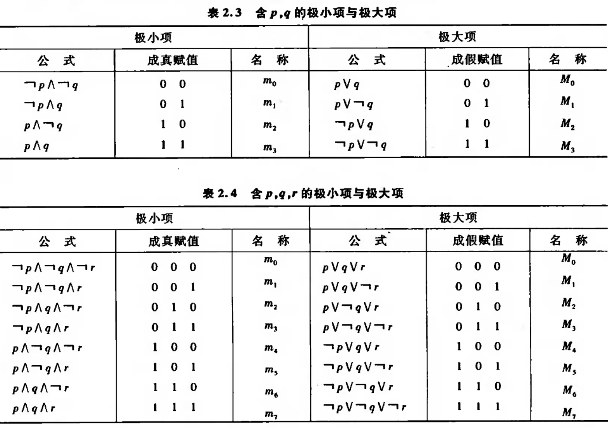

# 离散数学

[TOC]

## 第一部分 数理逻辑

### 第一章 命题逻辑的基本概念

#### 1.1 命题与联结词

##### 命题的定义

能判断其**真假**的**陈述句**

##### 优先级

$（），\lnot，\wedge，\vee，\to，\leftrightarrow$

##### p $\to$ q

q为p的必要条件，1 $\to$ 0 $\Leftrightarrow$ 0

#### 命题公式及其赋值

##### 命题层次

1. A = $\lnot$ B，$n+1$
2. A = B $\wedge$ C，$\vee,\to,\gets,\leftrightarrow$ ， $max(i,j)+1$
3. p为0层

##### 公式类型

1. 重言式：真值表全为1
2. 矛盾式：真值表全为0
3. 可满足式：真值表至少一项为1

### 第二章 命题逻辑等值演算

#### 2.1 等值式

##### 等值式模式

|      定律      |                                    |                                   |
| :------------: | :--------------------------------: | :-------------------------------: |
|   蕴涵等值式   |             $A \to B$              |         $\lnot A \vee B$          |
|     分配律     |       $A \vee (B \wedge C)$        |  $(A \vee B) \wedge (A \vee C)$   |
|     分配律     |       $A \wedge (B \vee C)$        | $(A \wedge B) \vee (A \wedge C)$  |
|    德摩根律    |         $\lnot (A \vee B)$         |     $\lnot A \wedge \lnot B$      |
|    德摩根律    |         $\lnot (A \vee B)$         |     $\lnot A \wedge \lnot B$      |
|     吸收律     |       $A \vee (A \wedge B)$        |                $A$                |
|     吸收律     |       $A \wedge (A \vee B)$        |                $A$                |
|     结合律     |        $(A \vee B) \vee C$         |        $A \vee (B \vee C)$        |
|     结合律     |      $(A \wedge B) \wedge C$       |      $A \wedge (B \wedge C)$      |
|     归谬论     | $(A \to B) \wedge (A \to \lnot B)$ |             $\lnot A$             |
|   双重否定律   |          $\lnot \lnot A$           |                $A$                |
|     幂等律     |             $A \vee A$             |                $A$                |
|     幂等律     |            $A \wedge A$            |                $A$                |
|     交换律     |             $A \vee B$             |            $B \vee A$             |
|     交换律     |            $A \wedge B$            |           $B \wedge A$            |
|      零律      |             $A \vee 1$             |                $1$                |
|      零律      |            $A \wedge 0$            |                $0$                |
|     同一律     |             $A \vee 0$             |                $A$                |
|     同一律     |            $A \wedge 1$            |                $A$                |
|     排中律     |          $A \vee \lnot A$          |                $1$                |
|     矛盾律     |         $A \wedge \lnot A$         |                $0$                |
|   假言易位式   |             $A \to B$              |       $\lnot A \to \lnot B$       |
|   等价等值式   |       $A \leftrightarrow B$        |    $(A \to B)\wedge(B \to A)$     |
| 等价否定等值式 |       $A \leftrightarrow B$        | $\lnot A \leftrightarrow \lnot B$ |

#### 2.2 析取范式与合取范式

##### 文字

命题变项及其否定

##### 简单析(合)取式

由有限个文字构成的析取式

##### 析(合)取范式

有限个简单析取式构成的析取式

##### 求范式

1. 消去连结词 $$\to ~ \leftrightarrow$$
2. 用**德摩根律**内移否定符
3. 使用**分配律**使括号外符号相同

##### 极小(大)项

每个极小项有且仅有**一个成真赋值**

##### 主析(合)取范式

所有简单合(析)取式都是极**小**(大)值的**析**(合)取范式

通过在主**合取**范式括号内 $\vee (Q \wedge \lnot Q)$ 和在主**析取**范式 $\wedge (Q \vee \lnot Q)$ 获得

### 第三章 命题逻辑的推理推论 🌟

#### 推理定律

|                             公式                             |    名称    |
| :----------------------------------------------------------: | :--------: |
|                  $A \Rightarrow (A \vee B)$                  |   附加律   |
|                $（A \wedge B) \Rightarrow A$                 |   简化律   |
|              $(A \to B) \wedge A \Rightarrow B$              |  假言推理  |
|       $(A \to B) \wedge \lnot B  \Rightarrow \lnot A$        |   拒收式   |
|          $(A \vee B) \wedge \lnot B \Rightarrow A$           | 析取三段式 |
|        $(A \to B)\wedge(B \to C) \Rightarrow A \to C$        | 假言三段式 |
| $(A \leftrightarrow B) \wedge (B \leftrightarrow C) \Rightarrow A \leftrightarrow C$ | 等价三段式 |
| $(A \to B) \wedge (C \to D) \wedge (A \vee C) \Rightarrow B \vee D$ | 构造性二难 |
|       $(A \to B) \wedge (\lnot A \to B) \Rightarrow B$       | 构造性二难 |
| $(A \to B) \wedge (C \to D) \wedge (\lnot B \vee \lnot D) \Rightarrow \lnot A \vee \lnot C$ | 破坏性二难 |

#### 自然推理系统P

1. 字母表
2. 合取公式
3. 推理定理
	 - **前提引入规则**：引入前提
	 - **结论引入规则**：将所得结论作为后续证明的前提
	 - **置换规则**：运用两类等值公式置换
	 - **推理定理**九条
	 - **化简规则**

#### 归谬法

把结论的否定作为附加前提，推出矛盾

需要用到附加前提引入

#### 附加前提证明法

若结论为$s \to r$，则将$s$放到前提中，结论改为$r$

### 第四章 一阶逻辑基本概念

$$
\forall x (P(x)\to Q(x))
$$

#### 个体

可独立存在的客体 $~~~x$

#### 个体域

个体变动的取值范围 $~~~P(x)$

#### 谓词

用来说明个体的性质或个体间关系$~~~\to$

#### 量词

##### 全称量词

$\forall$，后接 $\to$ (条件连接词) $~~~\forall(P(x)\to Q(x))$

##### 存在量词

$\exists$，后接 $\wedge$ (合取连接词) $~\exist (P(x)\wedge Q(x))$

#### 量词的辖域

量词的作用范围 $~~~(P(x)\to Q(x))$

### 第五章 一阶逻辑等值演算与推理

#### 谓词逻辑等价式

设A和B是任意的两个谓词，若$A\leftrightarrow B$为永真，则$A\Leftrightarrow B$

##### 1. 命题逻辑中的等价式的代换实例

命题逻辑等价式转换而来

##### 2. 量词否定转移

$$
\lnot \forall x P(x) \Leftrightarrow \exists x \lnot P(x)
$$
$$
\lnot \exists x P(x) \Leftrightarrow \forall x \lnot P(x)
$$

##### 3. 量词辖域的收缩和扩张

(1)

$$
\forall x(A(x)\vee B) \Leftrightarrow \forall xA(x) \vee B
$$
$$
\forall x(A(x)\wedge B) \Leftrightarrow \forall xA(x) \wedge B
$$
$$
\forall x(A(x)\to B) \Leftrightarrow \exists xA(x) \to B
$$
$$
\forall x(B \to A(x)) \Leftrightarrow B \to \forall xA(x)
$$

(2)

$$
\exists x(A(x)\vee B) \Leftrightarrow \exists xA(x) \vee B
$$
$$
\exists x(A(x)\wedge B) \Leftrightarrow \exists xA(x) \wedge B
$$
$$
\exists x(A(x)\to B) \Leftrightarrow \forall xA(x) \to B
$$
$$
\exists x(B \to A(x)) \Leftrightarrow B \to \exists xA(x)
$$

##### 4. 变量分配律

$$
\forall x(A(x)\wedge B(x))\Leftrightarrow \forall xA(x) \wedge \forall xB(x)
$$
$$
\exists x(A(x)\vee B(x))\Leftrightarrow \exists xA(x) \vee \exists xB(x)
$$

#### 前束范式

将**量词**提到最前面

#### 谓词演算的推理理论

$$
c~和~x~为个体域中的个体
$$

##### 1. UI（全称量词消去规则）
$$
\forall xA(x) \Rightarrow A(c)
$$

##### 2. EI（存在量词消去规则）

$$
\exists xA(x) \Rightarrow A(c)
$$

##### 3. UG（全称量词引入规则）

$$
A(y) \Rightarrow \forall xA(x)\\
y为任意值
$$

##### 4. EG（存在量词引入规则）

$$
A(c) \Rightarrow \exists xA(x)
$$

## 第二部分 集合论

### 第六章 集合代数

#### 集合的基本运算

- 并运算：

$$
A\cup B = \{x|x \in A \vee x \in B\}
$$

- 交运算：

$$
A\cap B = \{x|x \in A \wedge x \in B\}
$$

- 差运算：

$$
A-B = \{x|x \in A \wedge x \notin B\}
$$

- 对称差：

$$
A \oplus B = \{x| (x \in A \wedge x \notin B) \vee (x \in B \wedge x \notin A)\}
$$

- 幂集：

$$
P(A) = \{x|x \subseteq A \}
$$

$$
P(\varnothing)=2^0~~~P(\{\varnothing\})=2^1~~~P(\{\varnothing, \{\varnothing\}\})=2^2
$$

#### 集合相等的证明

| 定律   |                                                  |
|:------:|:------------------------------------------------:|
| 摩根律 | $\sim (A \cup B) = \sim A \cap \sim B$           |
| 摩根律 | $\sim (A \cap B) = \sim A \cup \sim B$           |
| 分配律 | $A \cap (B \cup C) = (A \cap B) \cup (A \cap C)$ |
| 分配律 | $A \cup (B \cap C) = (A \cup B) \cap (A \cup C)$ |
| 吸收律 | $A \cup (A \cap B) = A$                          |
| 吸收律 | $A \cap (A \cup B) = A$                          |
| 补律   | $A \cap \sim A = \varnothing$                    |
| 补律   | $A \cup \sim A = E$                              |
| 集合律 | $A \cup (B \cup C) = (A \cup B) \cup C$          |
| 集合律 | $A \cap (B \cap C) = (A \cap B) \cap C$          |
| 恒等律 | $A \cup \varnothing = A$                         |
| 恒等律 | $A \cap E = A$                                   |
| 支配律 | $A \cup C = E$                                   |
| 支配律 | $A \cap \varnothing = \varnothing $              |
| 幂等律 | $A \cup A =A$                                    |
| 幂等律 | $A \cap A = a$                                   |
| 双否律 | $\sim(\sim A) = A$                               |
| 交换律 | $A \cup B = B \cup A $                           |
| 交换律 | $A \cap B = B \cap A$                            |

#### 包含排斥原理

$$
\begin{align}
|A \cup B|=&|A|+|B|-|A \cap B|\\\\
|\overline A \cap \overline B| =& |E| - |A \cap B|\\\\
|A \cup B \cup C| =& |A| + |B| + |C| - |A \cap B| -|B \cap C| - |C \cap A| + |A\cap B \cap C|
\end{align}
$$

### 第七章 二元关系

#### 笛卡尔积

$$
A \times B = \{<x, y> | x \in A \wedge y \in B \}
$$

##### A 到 B 的关系

$A \times B$ 的任一子集

##### A 上的关系

$A \times A$ 的任一子集

##### A 上的特殊关系

空关系：$\varnothing$

全域关系 $E_A$：$A \times A$ 的所有子集

恒定关系 $I_A$：$\{<x, x> | x \in A \}$

#### 关系的性质

$domR$：第一元 定义域

$ranR$：第二元 值域

$R^{-1}$：第一元与第二元交换

$R^2 = R \circ R$：$\{<x, z> | <x, y> \in R~\wedge <y, z> \in R \}$

##### R在A上自反

$$
\forall x(x \in A \to <x, x> \in R)
$$

##### R在A上反自反

$$
\forall x(x \in A \to <x, x> \notin R)
$$

##### R在A上对称

$$
\forall x \forall y (x, y \in A~\wedge<x, y> \in R \to  <y, x> \in R)
$$

##### R在A上反对称

$$
\forall x \forall y (x, y \in A~\wedge<x, y> \in R~\wedge <y, x> \in R
\to  x=y)
$$
$$
\forall x \forall y (x, y \in A~\wedge<x, y> \in R~\wedge x \neq y 
\to <y, x> \notin R)
$$

##### R在A上传递

$$
\forall x \forall y \forall z(x, y, z \in A~\wedge<x, y> \in R 
~\wedge <y, z> \in R \to <x, z> \in R)
$$

##### 自反闭包

$$
r(R) = R \cup I_A
$$

##### 对称闭包

$$
s(R) = R \cup R^{-1}
$$

##### 传递闭包 

$$
t(R) = R \cup R^2 \cup R^3 \cdots R^n(n = |A|)
$$

#### 等价关系和等价类

##### 等价关系

R 是非空集合 A 上的关系，且 R 是**自反、对称、传递**

若 $<x, y> \in R$，则称 **x 等价于 y**，记做 $x \sim y$ 或 $xRy$

**全序集合**内任何一对元素都是相互可比较的

##### 等价类

R 是非空集合 A上的等价关系且 $x \in A$
$$
[x]_R = \{y|y \in A \wedge xRy(<x, y> \in R)\} = [y]_R
$$

#### 偏序关系和哈斯图

##### 偏序关系

R 是非空集合 A 上的关系，且 R 是**自反、反对称、传递**

若 $<x, y> \in R$，记作 $x \preceq y$ 

A 和 A 上的偏序关系 R 一起叫做偏序集，记作 $(A , R)$ 或  $(A, \preceq)$

**偏序集合**内只有部分元素之间是可以比较的

##### [哈斯图](https://zhuanlan.zhihu.com/p/57534317)

1. 由于偏序关系具有自反性，可以去掉不必要的**环**

2. 由于偏序关系具有传递性，可以去掉不必要的**边**

3. 由于偏序关系具有反对称性，可以去掉不必要的**箭头**

### 第八章 函数

#### 定义和性质

##### 函数的定义

F 为二元关系，$ \forall x \in domF $ 都存在唯一的 $y \in ranF$ ，如有 xFy，记作 y = F(x) 

##### 函数的性质

$$
F = G \Leftrightarrow F \subseteq G \wedge G \subseteq F
$$

所有由 A 到 B 的函数的集合：
$$
B^A = \{f~|~f: A \to B\}
$$

$$
\varnothing^{\varnothing} = \{\varnothing\}\\
B^{\varnothing} = \{\varnothing\}\\
\varnothing^A = \varnothing
$$

## 第五部分 图论

### 图的基本概念

**阶数：**图的顶点数

#### 握手定理

度的数目等于边数的两倍

因为度数必为偶数，度为奇数的结点的个数为偶数

#### 图的分类

##### 简单图

无平行边且无环

##### 弱连通图

有向图变无向图后才连通

##### 单向连通图

任意两结点可单向连通

##### 强连通图

任意两节点相互可达

##### 有向连通图

弱连通图、单向连通图、 强连通图

#### 通路的分类

##### 基本通路

边无重复且点无重复

##### 简单通路

边无重复

#### 回路的分类

起点和终点相同的通路为回路

##### 基本回路

边无重复且点无重复

##### 简单回路

边无重复

#### 长度为N的通路

邻接矩阵的N次方：$A^N$

左行右列

### 欧拉图与哈密顿图

#### 欧拉图

具有欧拉**回路**的图

##### 半欧拉图

只具有欧拉通路的图

##### 欧拉通路(回路)

通过所有**边**一次且仅一次的通路(回路)

##### 欧拉图判定

无向欧拉图 $\Leftrightarrow$ 所有结点度数为偶

无向半欧拉图 $\Leftrightarrow$ 有且只有两个奇度结点

有向欧拉图 $\Leftrightarrow$ 每个结点出度=入度

有向半欧拉图 $\Leftrightarrow$ 一个结点出度-入度=1，另一个结点入度-出度=1

#### 哈密顿图

##### 哈密顿通路(回路)

通过所有**结点**一次且仅一次的通路(回路)

#### 最短路径 Dijkstra

1. 标记集 `cllc[u]=true`

2. 距离集 `dist[u]=0，其他为 10e10`

3. 找出 `dist` 最小的 V，`cllc[V]=true`

4. 改善 V 的邻接点到 u 的 `dist`

5. 循环到3

### 树

#### 树的定义

连通且无回路的无向图

树的边数 = 顶点数-1

#### 最小生成树

连通图中的所有生成树中带权最小的

##### 避圈法 Kruskal

1. 将所有边从小到大排列

2. 在不形成回路的情况下，用边一条条连通结点

3. 检查是否生成了树

#### 最优二元树

##### Huffman创建

1. 找出目前权值最小的两个节点

2. 合并节点形成新根，为新根赋权

3. 递归到1

##### Huffman编码

1. 循环每个叶结点
2. 向上编码直到根结点
3. 倒序不等长编码，使其从根结点开始

