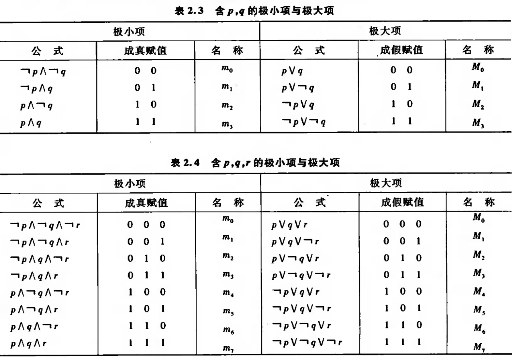

# 离散数学

---

## 第一部分 数理逻辑

### 第一章 命题逻辑的基本概念

#### 1.1 命题与联结词

##### 命题的定义

能判断其**真假**的**陈述句**

##### 优先级

$（），\lnot，\wedge，\vee，\to，\leftrightarrow$

##### p $\to$ q

q为p的必要条件，1 $\to$ 0 $\Leftrightarrow$ 0

#### 命题公式及其赋值

##### 命题层次

1. A = $\lnot$ B，$n+1$
2. A = B $\wedge$ C，$\vee,\to,\gets,\leftrightarrow$ ， $max(i,j)+1$
3. p为0层

##### 公式类型

1. 重言式：真值表全为1
2. 矛盾式：真值表全为0
3. 可满足式：真值表至少一项为1

### 第二章 命题逻辑等值演算

#### 2.1 等值式

##### 等值试模式

|      定律      |                                    |                                   |
| :------------: | :--------------------------------: | :-------------------------------: |
|   蕴涵等值式   |             $A \to B$              |         $\lnot A \vee B$          |
|     分配律     |       $A \vee (B \wedge C)$        |  $(A \vee B) \wedge (A \vee C)$   |
|     分配律     |       $A \wedge (B \vee C)$        | $(A \wedge B) \vee (A \wedge C)$  |
|    德摩根律    |         $\lnot (A \vee B)$         |     $\lnot A \wedge \lnot B$      |
|    德摩根律    |         $\lnot (A \vee B)$         |     $\lnot A \wedge \lnot B$      |
|     吸收律     |       $A \vee (A \wedge B)$        |                $A$                |
|     吸收律     |       $A \wedge (A \vee B)$        |                $A$                |
|     结合律     |        $(A \vee B) \vee C$         |        $A \vee (B \vee C)$        |
|     结合律     |      $(A \wedge B) \wedge C$       |      $A \wedge (B \wedge C)$      |
|   双重否定律   |                $A$                 |             $\lnot A$             |
|     幂等律     |                $A$                 |            $A \vee A$             |
|     幂等律     |                $A$                 |           $A \wedge A$            |
|     交换律     |             $A \vee B$             |            $B \vee A$             |
|     交换律     |            $A \wedge B$            |           $B \wedge A$            |
|      零律      |             $A \vee 1$             |                $1$                |
|      零律      |            $A \wedge 0$            |                $0$                |
|     同一律     |             $A \vee 0$             |                $A$                |
|     同一律     |            $A \wedge 1$            |                $A$                |
|     排中律     |          $A \vee \lnot A$          |                $1$                |
|     矛盾律     |         $A \wedge \lnot A$         |                $0$                |
|    假言易位    |             $A \to B$              |       $\lnot A \to \lnot B$       |
|     归谬论     | $(A \to B) \wedge (A \to \lnot B)$ |             $\lnot A$             |
|   等价等值式   |       $A \leftrightarrow B$        |    $(A \to B)\wedge(B \to A)$     |
| 等价否定等值试 |       $A \leftrightarrow B$        | $\lnot A \leftrightarrow \lnot B$ |

#### 2.2 析取范式与合取范式

##### 文字

命题变项及其否定

##### 简单析(合)取式

由有限个文字构成的析取式

##### 析(合)取范式

有限个简单析取式构成的析取式

##### 求范式

1. 消去连结词 $$\to ~ \leftrightarrow$$
2. 用德摩根内移否定符
3. 使用分配律

##### 极小(大)项

每个极小项有且仅有一个成真赋值

##### 主析取范式

所有简单合取式都是极小值的析取范式

### 第三章 命题逻辑的推理推论

#### 推理定律

|                             公式                             |    名称    |
| :----------------------------------------------------------: | :--------: |
|                  $A \Rightarrow (A \vee B)$                  |   附加律   |
|                $（A \wedge B) \Rightarrow A$                 |   简化律   |
|              $(A \to B) \wedge A \Rightarrow B$              |  假言推理  |
|       $(A \to B) \wedge \lnot B  \Rightarrow \lnot A$        |   拒收式   |
|          $(A \vee B) \wedge \lnot B \Rightarrow A$           | 析取三段式 |
|        $(A \to B)\wedge(B \to C) \Rightarrow A \to C$        | 假言三段式 |
| $(A \leftrightarrow B) \wedge (B \leftrightarrow C) \Rightarrow A \leftrightarrow C$ | 等价三段式 |
| $(A \to B) \wedge (C \to D) \wedge (A \vee C) \Rightarrow B \vee D$ | 构造性二难 |
|       $(A \to B) \wedge (\lnot A \to B) \Rightarrow B$       | 构造性二难 |
| $(A \to B) \wedge (C \to D) \wedge (\lnot B \vee \lnot D) \Rightarrow \lnot A \vee \lnot C$ | 破坏性二难 |

#### 自然推理系统P

1. 字母表
2. 合取公式
3. 推理定理
	 - **前提引入规则**：引入前提
	 - **结论引入规则**：将所得结论作为后续证明的前提
	 - **置换规则**：运用等值公式置换
	 - **推理定理**9条

#### 归谬法

把结论的否定作为附加前提，退出矛盾

- 附加前提引入

#### 附加前提证明法

若结论为$s \to r$，则将$s$放到前提中，结论改为$r$

### 第四章 一阶逻辑基本概念

#### 个体

可独立存在的客体

#### 个体域

个体变动的取值范围

#### 谓词

用来说明个体的性质或个体间关系

#### 量词

##### 全称量词

$\forall$，后面接 $\to$ (条件连接词)

##### 存在量词

$\exists$，后接 $\vee$ (合取连接词)

$$
\forall x (P(x)\wedge Q(x))
$$

#### 量词的辖域

量词的作用范围

$(P(x)\wedge Q(x))$

### 第五章 一阶逻辑等值演算与推理

#### 谓词逻辑等价式

设A和B是任意的两个谓词，若$A\leftrightarrow B$为永真，则$A\Leftrightarrow B$

##### 1. 命题逻辑中的等价式的代换实例

##### 2. 量词否定转移

$\lnot \forall x P(x) \Leftrightarrow \exists x \lnot P(x)$

$\lnot \exists x P(x) \Leftrightarrow \forall x \lnot P(x)$

##### 3. 量词辖域的收缩和扩张

(1)

$\forall x(A(x)\vee B) \Leftrightarrow \forall xA(x) \vee B$

$\forall x(A(x)\wedge B) \Leftrightarrow \forall xA(x) \wedge B$

$\forall x(A(x)\to B) \Leftrightarrow \exists xA(x) \to B$

$\forall x(B \to A(x)) \Leftrightarrow B \to \forall xA(x)$

(2)

$\exists x(A(x)\vee B) \Leftrightarrow \exists xA(x) \vee B$

$\exists x(A(x)\wedge B) \Leftrightarrow \exists xA(x) \wedge B$

$\exists x(A(x)\to B) \Leftrightarrow \forall xA(x) \to B$

$\exists x(B \to A(x)) \Leftrightarrow B \to \exists xA(x)$

##### 4. 变量分配律

$\forall x(A(x)\wedge B(x))\Leftrightarrow \forall xA(x) \wedge \forall xB(x)$

$\exists x(A(x)\vee B(x))\Leftrightarrow \exists xA(x) \vee \exists xB(x)$

#### 前束范式

## 第二部分 集合论

### 第六章 集合代数

### 第七章 二元关系

### 第八章 函数

## 第三部分 代数结构

### 第九章 代数系统

### 第十章 群与环

### 第十一章 格与布尔代数

## 第四部分 组合数学

### 第十二章 基本

## 第五部分 图论

## 第六部分 初等数论

